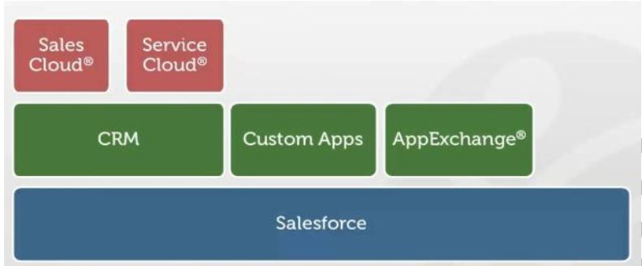

# Salesforce

# UNIT 1

---

## Cloud Computing

- **Definition**:
    
    Cloud computing is the on-demand delivery of IT resources over the internet with pay-as-you-go pricing. It allows businesses to access computing services (storage, servers, databases, software, etc.) without owning physical hardware.
    
- **Key Characteristics**:
    1. **On-demand self-service**: Access resources anytime without human intervention.
    2. **Broad network access**: Accessible through any device with an internet connection.
    3. **Resource pooling**: Multiple users share the same physical resources.
    4. **Rapid elasticity**: Resources can scale up or down based on demand.
    5. **Measured Service**: Pay only for what you use.
- **Service Models**:
    1. **IaaS (Infrastructure as a Service)**: Offers virtual machines, storage, and networks (e.g., AWS EC2, Microsoft Azure).
    2. **PaaS (Platform as a Service)**: Provides development platforms and tools (e.g., Heroku, Google App Engine).
    3. **SaaS (Software as a Service)**: Delivers software applications over the internet (e.g., Salesforce, Google Workspace).
- **Benefits of Cloud Computing**:
    - Cost savings (no need for infrastructure investment).
    - Flexibility and scalability.
    - High availability and disaster recovery options.
    - Security and compliance management by service providers.

---

## **Introduction to Salesforce**

- **What is Salesforce?**
    
    Salesforce is a **cloud-based Customer Relationship Management (CRM)** platform that provides tools for businesses to manage customer relationships, sales, service, marketing, and more. It is built on a multi-tenant architecture that ensures scalability, reliability, and data security.
    
- **Core Features**:
    1. **Sales Cloud**: Manages sales processes and customer interactions.
    2. **Service Cloud**: Helps handle customer support cases and workflows.
    3. **Marketing Cloud**: Focuses on customer engagement through campaigns.
    4. **Community Cloud**: Connects users, customers, and partners on a single platform.
- **Why is Salesforce Unique?**
    - Fully hosted in the cloud (SaaS).
    - No hardware/software installation required.
    - Easily customizable with declarative tools.
    - A vast ecosystem of apps via **AppExchange**.

---

## **Benefits of Salesforce in CRM**

- **CRM Overview**:
    
    CRM stands for “customer relationship management” and it’s software that stores customer contact information like names, addresses, and phone numbers, as well as keeps track of customer activity like website visits, phone calls, email, and more.
    In other words, A CRM system is a business tool that allows you to manage all your customers,
    partners and prospects information all in one place. It allows all departments to refer one database to get data about your customer, sales, issues etc.,
    We need not depend on person. Whereas we are going to depend on system any time we need.
    
    
    
- **Benefits of Using Salesforce as CRM**:
    1. **Centralized Data**: All customer information is stored in one place, accessible across departments.
    2. **Improved Customer Experience**: Real-time insights into customer preferences enable personalized interactions.
    3. **Automation**: Tasks like sending follow-ups and setting reminders are automated.
    4. **Scalability**: Salesforce can grow with the business by adding users and functionality.
    5. **Data Security**: Advanced security measures like role-based access and two-factor authentication protect sensitive data.
    6. **Analytics and Reporting**: Helps track business performance through dashboards and reports.
    7. **App Ecosystem**: Extend capabilities using thousands of pre-built apps on the Salesforce AppExchange.



- **Example**:
    
    A retail company uses Salesforce to analyze sales trends, improve customer loyalty, and streamline service queries, resulting in higher customer retention.
    

---

## **Salesforce Architecture Overview**

- **Multi-Tenant Architecture**:
    
    In Salesforce, a **multi-tenant architecture** refers to the design model in which a single instance of the software (Salesforce platform) is shared by multiple customers, often called tenants. This architecture allows different organizations (tenants) to run their applications on the same infrastructure while keeping their data and configurations isolated and secure.
    
- **Core Components**:
    1. **Database**: Salesforce objects (standard and custom) store data in relational database tables.
    2. **Metadata-Driven Development**: Applications are built declaratively using metadata without coding.
    3. **APIs**: Salesforce provides robust APIs (REST, SOAP) for integration and automation.
    4. **AI-Powered Features**: Einstein AI provides predictive insights and analytics.
- **Layers in Salesforce Architecture**:
    1. **Application Layer**: Includes Salesforce apps like Sales Cloud, Service Cloud, etc.
    2. **Platform Layer**: Provides tools for developers (Apex, Visualforce, Lightning).
    3. **Database Layer**: Stores data securely with built-in reporting and querying capabilities.

---

## **Understanding Objects, Fields, and Relationships**

### **Objects:**

- Objects are tables in the Salesforce database where data is stored.
    - **Standard Objects**: Predefined by Salesforce (e.g., Account, Contact, Lead).
    - **Custom Objects**: User-defined to store specific business data.

### **Fields:**

- Fields are the columns in an object that hold specific pieces of data (e.g., Name, Email, Phone).
    - **Standard Fields**: Predefined fields included with standard objects.
    - **Custom Fields**: Created to capture additional data specific to the business.

### **Relationships:**

- **Definition**: Relationships connect objects and determine how data is linked.
    1. **Lookup Relationship**: Creates a loose link between two objects. Deleting a parent doesn’t affect child records.
    2. **Master-Detail Relationship**: A tightly linked relationship where the child depends on the parent. Deleting the parent deletes the child records.
    3. **Many-to-Many Relationship**: Achieved through a junction object that links two objects.
- **Use Case Example**:
    
    An Account object is linked to multiple Contacts via a Lookup Relationship, and a master-detail relationship links Opportunities to Accounts.
    

---

## **Data Model Design Best Practices**

- **Key Principles**:
    1. Use **standard objects** when possible to maintain compatibility with Salesforce updates.
    2. Minimize the number of **custom objects and fields** to reduce complexity.
    3. Create meaningful **naming conventions** for objects and fields.
    4. Use **relationships** (lookup or master-detail) to link data effectively.
    5. Use **formula fields** to derive values dynamically rather than storing duplicate data.
    6. Regularly review and optimize data models to improve performance and usability.
- **Examples of Best Practices**:
    - Avoid duplicating data in multiple objects—use relationships instead.
    - Use **global picklists** to standardize values across objects.
    - Limit the use of **triggers and workflows** to avoid performance issues.

---

## Basic Terms

### **1. Views in Salesforce**

**Views** allow users to filter and display specific records based on certain criteria. They are designed to simplify the process of managing and accessing data in Salesforce. There are two primary types of views:

- **List Views**:
    - **Purpose**: Used to display a list of records based on specific filter criteria.
    - **Customization**: Users can define filters, fields to be displayed, and sorting options.
    - **Use Case**: A sales representative can create a list view to display all open opportunities in a specific region or accounts with overdue tasks.
    
    
    
    - **Types**:
        - **Standard List Views**: Predefined views (e.g., "All Opportunities").
        - **Custom List Views**: Views created by users to tailor their list of records according to their needs.
- **Calendar Views**:
    - **Purpose**: Displays records (such as events, tasks, or opportunities) in a calendar format.
    - **Customization**: Users can filter records by type, and see them on a daily, weekly, or monthly basis.

---

### **2. Page Layouts in Salesforce**

**Page Layouts** control the layout and structure of the user interface for records. They define which fields, related lists, and buttons are visible to users and where they appear on a page.


- **Components of Page Layouts**:
    - **Fields**: Determine which fields are visible and in what order on the record page.
    - **Sections**: Group related fields together for better organization (e.g., Account Information, Contact Details).
    - **Related Lists**: Display records related to the current record (e.g., related opportunities for an Account).
    - **Buttons and Links**: Custom buttons or links for executing actions on records.
    - **Visualforce Pages**: Embedded custom components that provide additional functionality.
- **Customization**:
    - Page layouts can be customized for different user profiles. For instance, a sales manager might see additional fields or sections that regular users don't.
    - Layouts can be assigned to different record types (e.g., one layout for a Business Account and another for a Consumer Account).
- **Use Case**: A user might have a different layout for viewing a Contact record compared to viewing an Opportunity, allowing for more relevant information to be displayed based on the user's role.

---

### **3. Related Lists in Salesforce**

**Related Lists** are sections on a page layout that display records related to the current record. These are typically shown on the detail page of a record and allow users to access associated records quickly.


- **Examples of Related Lists**:
    - **Contacts on an Account record**: Lists all contacts associated with a specific account.
    - **Opportunities on an Account record**: Displays all opportunities related to a given account.
    - **Activities (Tasks and Events) on a Contact or Opportunity record**: Shows all tasks and events associated with a record.
- **Customization**:
    - Administrators can define which related lists to display on record pages and their order.
    - Related lists can be customized to show specific fields or be filtered based on certain criteria.
- **Use Case**: On an Account record, the related list might display all active opportunities and contacts associated with that account, making it easier for users to track progress and communications.

---

### **4. Tabs in Salesforce**

**Tabs** in Salesforce provide easy access to the different objects and features available in Salesforce. They act as the main navigation tool, allowing users to switch between various sections of the application.


- **Types of Tabs**:
    - **Standard Tabs**: Predefined tabs that correspond to standard Salesforce objects (e.g., Accounts, Contacts, Opportunities, Leads).
    - **Custom Tabs**: Custom-created tabs that link to custom objects, Visualforce pages, or web content (e.g., a custom tab for a third-party integration or app).
    - **App Tabs**: These are related to apps and provide access to a set of related tabs under one app, like the Sales app or Service app.
- **Customization**:
    - Salesforce administrators can configure the tabs that are available for users through profiles or permission sets, controlling access to specific objects.
    - Tabs can be reordered to improve navigation.
- **Use Case**: A user working in the "Sales" app may primarily interact with tabs like Accounts, Opportunities, and Reports, whereas someone in customer service might focus on Cases and Knowledge.

---

### **Important Topics Asked Previously**

- **"What is Salesforce, and its benefits in CRM?"**
- **"What is a master-detail relationship, and its implications?"**
- **"Differentiate between lookup and master-detail relationships."**
- **"Explain the architecture of Salesforce."**
- **"Define standard vs. custom objects and fields."**

---

# UNIT 2

### **Types of Objects in Salesforce**

Salesforce objects form the foundation of data storage in Salesforce. They are used to define the structure of data that needs to be stored and accessed.


1. **Standard Objects**:
    - Predefined by Salesforce and used to support core CRM functionality.
    
    
    
    - Examples:
        - **Account**: Stores information about companies or organizations that are Salesforce customers.
        - **Contact**: Contains details about individuals associated with accounts.
        - **Opportunity**: Tracks potential sales deals.
        - **Lead**: Represents unqualified prospects who might become customers.
        - **Case**: Used for tracking customer complaints or requests.
        - **Campaign**: Helps manage marketing initiatives and their effectiveness.
2. **Custom Objects**:
    - Created by users to store specific data unique to their business processes.
    - Examples:
        - **Invoice__c**: Stores details about invoices sent to customers.
        - **Project__c**: Tracks the progress of projects.
    - Features:
        - Can have custom fields, validation rules, workflows, and relationships.
        - Used when the default functionality of standard objects doesn’t meet business needs.
    
    
    
    
    
3. **External Objects**:
    - Represent data stored outside of Salesforce.
    - Used with **Salesforce Connect** to access external data in real time.
    - Features:
        - Data is not imported into Salesforce but accessed via an external data source.
        - Requires an **external data source** configuration.
    - Example: Accessing order details from an external ERP system.
4. **Big Objects**:
    - Designed to store and manage a large volume of data efficiently.
    - Features:
        - Suitable for historical data, such as event logs or system archives.
        - Supports standard and custom fields.
        - Querying is limited to **Async SOQL** for performance reasons.
    - Example: Tracking millions of records for compliance or audits.

---

## **Types of Relationships in Salesforce**

Relationships in Salesforce allow you to define how objects are related to each other. These relationships form the basis for data interaction and reporting.

[https://encrypted-tbn0.gstatic.com/images?q=tbn:ANd9GcTt4SuQSXXAtVO3WV-UF7aFl88q_AD9BRqzsA&s](https://encrypted-tbn0.gstatic.com/images?q=tbn:ANd9GcTt4SuQSXXAtVO3WV-UF7aFl88q_AD9BRqzsA&s)

### **1. Master-Detail Relationship**:

A **Master-Detail Relationship** in Salesforce is a tightly bound relationship between two objects, where the **master record** controls certain behaviors of the **detail** (or child) record. This relationship also allows extending to a **sub-detail** record, creating a hierarchical structure for operations.

### **Key Concepts:**

- **Master-Detail Relationship**: Defines a relationship between two objects, such as Account—Expense Report, where the **Account** is the master and **Expense Report** is the detail.
- **Sub-detail Relationship**: A further extension, for example, linking **Expense Report** to **Expense Line Items**, creating a three-level relationship (Account → Expense Report → Expense Line Item).

### **Best Practices**:

- Create a master-detail relationship **before the custom object contains data**.
- As a best practice, **do not exceed 10,000 child records** in a master-detail relationship to avoid performance issues.
- A custom object can have **up to two master-detail relationships** and **up to 40 total relationships** (including lookups).

---

### **Behavior of Master-Detail Relationships:**

1. **Record Deletion**:
    - **Deleting a Detail Record**: Moves it to the Recycle Bin, leaving the master record intact.
    - **Deleting a Master Record**: Deletes the master record along with all related detail and sub-detail records.
    - **Undeleting**:
        - If a detail record is undeleted, it is restored.
        - Undeleting a master record restores the related detail and subdetail records.
        - If a master record is deleted separately after its detail record is deleted, the detail record **cannot** be undeleted as it no longer has a master record.
2. **Reparenting**:
    - By default, records **cannot be reparented** (i.e., a detail record cannot be linked to a different master record).
    - **Reparenting Option**: Administrators can enable reparenting of child records by selecting the **Allow reparenting** option in the master-detail relationship definition.
3. **Owner Field**:
    - The **Owner** field on the detail and sub-detail records is not available and is automatically set to the owner of the master record.
    - Custom objects on the detail side of a master-detail relationship **cannot** have sharing rules, manual sharing, or queues because these require the Owner field.
4. **Security and Permissions**:
    - **Inherited Permissions**: Detail and sub-detail records inherit security settings and permissions from the master record.
    - **No Independent Permission Setting**: Permissions on the detail record **cannot** be set independently from the master record.
5. **Page Layout**:
    - The **master-detail relationship field** (the field linking the objects) is **required** on the page layout for both the detail and sub-detail records.
6. **Master Object Types**:
    - The master object can be a **standard object** (e.g., Account, Opportunity) or a **custom object**.
7. **Field Updates**:
    - **Roll-up Summary Fields**: When creating a draft Knowledge Article version from a published version, the **Roll Up Summary** field on the draft carries forward the values of the published article. However, associated custom object records are not carried over to the draft version.

---

### **Restrictions and Limitations**:

1. **Related To Entry**:
    - Once a master-detail relationship is saved, the **Related To entry** cannot be changed.
2. **Permission Dependency**:
    - If the child entity has permissions that the parent entity should have, Salesforce updates the parent entity for broken permission dependencies on the **first save action** for a profile or permission set.
    - **Example**: If a child entity has **Modify All** or **View All**, the parent entity will be automatically granted **View All** or **Read**, respectively.
3. **Many-to-Many Relationships**:
    - **Master-Detail can be extended** to represent many-to-many relationships through junction objects. This allows a record to have multiple parent records (in contrast to a one-to-many relationship).

---

### **Summary of Master-Detail Relationship Behaviors**:

| **Behavior** | **Detail Record Impact** |
| --- | --- |
| **Record Deletion** | Deleting a master deletes related detail and sub-detail records |
| **Record Restoration** | Undeleting master restores detail and sub-detail records |
| **Reparenting** | Not allowed by default, but configurable for custom objects |
| **Owner Field** | Automatically set to the master record's owner |
| **Security Inheritance** | Permissions inherited from the master record |
| **Page Layout Requirement** | Master-detail relationship field required |
| **Maximum Relationships** | Up to 2 master-detail relationships and 40 total relationships per object |
| **Related To Field** | Cannot be changed after saving the relationship |

### **2. Lookup Relationship**:

A **Lookup Relationship** in Salesforce is used to link two objects together, enabling the creation of a reference between them. Unlike the **Master-Detail Relationship**, a **Lookup Relationship** does not enforce strict control over the related records and offers more flexibility.

Here’s a detailed breakdown of Lookup Relationships in Salesforce:

---

### **Key Concepts:**

1. **Linking Objects**:
    - A **Lookup Relationship** links one object to another, but it does not require strict dependencies between them.
    - You can create a lookup relationship between two **different objects** or link an object to itself (e.g., linking a **custom object** called "Bug" with itself to show how two different bugs relate to the same problem).
2. **Self-Linking**:
    - It is possible to create a **self-referencing lookup relationship**, where an object is related to itself. For example, a custom object for "Bug" could be linked to another "Bug" record to indicate that one bug is related to another.
    - **Important Note**: Lookup relationships from objects related to the **Campaign Member** object are not supported. However, you can create lookup relationships from the campaign member object to other objects.

---

### **Creating and Configuring a Lookup Relationship:**

When creating a **Lookup Relationship**, several options are available for configuring its behavior:

1. **Required Lookup Field**:
    - You can choose to make the lookup field **required** for saving a record, which means the associated lookup record must be selected before saving the record.
    - The lookup field will be displayed on the page layout as well.
2. **Behavior When Deleting a Lookup Record**:
    - You can specify what happens to the lookup field when the associated lookup record is deleted. The three available behaviors are:
        - **Clear the Value of This Field (Default)**: The value in the lookup field is cleared. This is useful when the field doesn't necessarily need to always point to a related record.
        - **Don’t Allow Deletion of the Lookup Record**: This option prevents the deletion of the lookup record if it is being used in any lookup relationship. This is useful when you have business dependencies based on the lookup relationship (e.g., workflows).
        - **Delete This Record Also**: Available only for **custom objects** containing the lookup relationship (not if the lookup field is contained by a standard object). Choosing this option will delete both the lookup record and the associated record. For example, if you have an **Expense Report** object linked via lookup to **Expense Line Items**, deleting the Expense Report will delete all related Expense Line Items.

---

### **Warning About Cascade-Delete**:

- **Cascade-Delete**: This option is available when choosing "Delete This Record Also." **Cascade-deletes** bypass security and sharing settings. This means users could potentially delete related records even if they don’t have direct access to them.
    - **Warning**: Cascade-delete is disabled by default for safety reasons. If you want to enable cascade-delete for your organization, you need to contact Salesforce support.
    - **Cascade-delete restrictions**: It is not available for relationships to certain objects like **business hours**, **network**, **lead**, **price book**, **product**, or **user objects**.

---

### **Other Lookup Relationship Considerations**:

1. **Page Layouts**:
    - You can add a **lookup field** to the page layouts of the object containing the lookup relationship.
    - Additionally, you can create a **related list** on the associated object’s page layout, which will display related records from the lookup.
2. **Field History Tracking**:
    - If the parent record in a lookup relationship is deleted, **field history tracking** for the child record **does not** record the deletion.
        - Example: If the parent **Account** record is deleted, the **Account History** related list for a child **Account** record will not show that the parent account was deleted.
3. **Deletion Restrictions**:
    - **Limit on Number of Records**: You cannot delete an object or record in a lookup relationship if the combined number of records between the two linked objects exceeds **100,000**. In such cases, you would first need to delete some child records before being able to delete the object.
    - **Deleting Objects and Fields**: If you wish to delete an object that has a lookup field, you must delete the **lookup field first**. Use the **Metadata API** or **Setup in the UI** to delete the field before deleting the object. Failing to do so will prevent the deletion of the object.

---

### **Summary of Lookup Relationship Features**:

| **Feature** | **Details** |
| --- | --- |
| **Field Requirements** | Lookup field can be required or optional for saving records |
| **Deletion Behavior** | Three options: Clear field, Don’t allow deletion, Delete this record also |
| **Cascade-Delete** | Disabled by default; can result in bypassing security & sharing settings |
| **Self-Linking** | Allows linking an object to itself (e.g., linking a "Bug" record to another "Bug" record) |
| **Page Layout** | Lookup field can be added to page layouts with related lists |
| **Field History Tracking** | Deletion of parent record doesn’t trigger field history tracking |
| **Record Deletion Limitation** | Deleting records in a lookup relationship restricted to 100,000 records combined |
| **Deletion of Objects/Fields** | Must delete the lookup field before deleting the object containing it |

### **3. Self-Relationship**:

- A lookup relationship where an object is related to itself.
- Example: **Employee** object where managers are related to their subordinates.

### **4. Many-to-Many Relationship**:

- You can use master-detail relationships to model *many-to-many* relationships between any two objects. A many-to-many relationship allows each record of one object to be linked to multiple records from another object and vice versa. For example, you create a custom object called Bug that relates to the standard case object such that a bug could be related to multiple cases and a case could also be related to multiple bugs.
- Created using a **junction object**.
- Features:
    - Allows multiple parents for a child and vice versa.
    - Requires two master-detail relationships to connect objects.
- Example: Linking **Campaign** and **Contact** using a junction object like **CampaignMember**.

### **5. Hierarchical Relationship**:

- A special lookup relationship available for only the user object. It lets users use a lookup field to associate one user with another that doesn’t directly or indirectly refer to itself. For example, you can create a custom hierarchical relationship field to store each user's direct manager.
- Used specifically in the **User** object to define roles and reporting relationships.
- Example: Manager-subordinate relationships among users.

### **6. External Lookup Relationship:**

An **External Lookup Relationship** in Salesforce is used to link a child standard, custom, or external object to a parent **external object**. This type of relationship is particularly useful when working with **external data sources**.

### **Key Concepts**:

1. **Child and Parent Objects**:
    - In an **External Lookup Relationship**, the child object can be a **standard object**, a **custom object**, or another **external object**.
    - The parent object is always an **external object**, which means it refers to data stored outside of Salesforce, typically in an **external data source**.
2. **External Data Source**:
    - The data in the parent external object comes from an **external system** or database, such as an **ERP system**, **cloud storage**, or other third-party services integrated into Salesforce.
    - The external object acts as a pointer to this external data without actually storing the data in Salesforce.
3. **External ID Field**:
    - An **External ID field** on the parent external object is crucial in the **External Lookup Relationship**.
    - When creating the relationship field, Salesforce matches the **External ID field** of the parent external object against the **values** in the child’s external lookup relationship field.
    - The **External ID field** is typically a unique identifier in the external system that helps Salesforce reference the correct record in the external data source.

### **Key Features of External Lookup Relationship**:

| **Feature** | **Description** |
| --- | --- |
| **Child Object** | Can be a standard, custom, or external object. |
| **Parent Object** | Must be an external object, representing data from an external data source. |
| **External ID** | A unique identifier used to match child records with parent external objects. |
| **Real-Time Data Access** | Data from external systems is accessed in real-time, not imported into Salesforce. |
| **Read-Only External Objects** | External objects cannot be edited directly within Salesforce. |
| **Field Matching** | Uses External ID to match the child’s external lookup field with the parent record in the external data source. |
| **Data Source Integration** | Requires integration with external data sources via **Salesforce Connect** or similar tools. |

---

## **Types of Fields in Salesforce**

Fields define the type of data an object can store.

1. **Standard Fields**:
    - Predefined by Salesforce on both standard and custom objects.
    - Examples:
        - **Name**: Unique identifier for records.
        - **OwnerId**: Identifies the user responsible for the record.
        - **CreatedDate**: Indicates when the record was created.
    - Exam Tip: Standard fields cannot be deleted but can be hidden from users.
2. **Custom Fields**:
    - Created by users to meet specific business requirements.
    - Field Types:
        - **Text**: Stores alphanumeric characters.
        - **Number**: Stores numeric data (e.g., quantities, ratings).
        - **Currency**: Stores monetary values.
        - **Picklist**: Provides a dropdown of predefined values.
        - **Formula**: Dynamically calculates values.
        - **Checkbox**: Represents binary data (True/False).
    - Exam Tip: Explain the difference between standard and custom fields.
3. **Formula Fields**:
    - Automatically calculate values based on other fields or formulas.
    - Example: Concatenating **First Name** and **Last Name** into a **Full Name**.
    - Exam Tip: Mention limitations, such as formula fields being read-only.
4. **Roll-Up Summary Fields**:
    - Aggregate data from related child records.
    - Examples:
        - Total revenue from **OpportunityLineItems** in an **Opportunity**.
        - Average grade of all students linked to a class.
    - Exam Tip: Focus on their limitations (e.g., only available on Master-Detail relationships).
5. **External ID Fields**:
    - Used to store unique identifiers for records from external systems.
    - Exam Tip: Highlight their role in data migration.
6. **Geolocation Fields**:
    - Store location data as latitude and longitude.
    - Useful for mapping and geographic reports.

### **All Salesforce Field Types**

| **Field Type** | **Description** |
| --- | --- |
| **Address** | **Allows users to enter a street, city, state/province, zip/postal code, country and to search for an address with an external tool. When a user selects an address using the tool, the street, city, state/province, zip/postal code, and country are populated.** |
| **Auto Number** | **Automatically assigns a unique number to each record with a maximum length of 30 characters.** |
| **Checkbox** | **Allows users to check a box, indicating a true or false attribute of a record.** |
| **Currency** | **Allows users to enter a currency amount that the system automatically formats.** |
| **Date** | **Allows users to enter or pick a date from a popup calendar.** |
| **Date/Time** | **Allows users to enter or pick a date from a popup calendar and enter an AM/PM time of day.** |
| **Email** | **Allows users to enter an email address up to 80 characters, validated to ensure proper format.** |
| **External Lookup Relationship** | **When you create an external lookup relationship field, the standard External ID field on the parent external object is matched against the values of the child’s external lookup relationship field. External object field values come from an external data source.** |
| **Formula** | **Allows users to automatically calculate values based on other values or fields such as merge fields. Not available for external objects.** |
| **Geolocation** | **Allows users to specify a location by its latitude and longitude.** |
| **Hierarchical Relationship** | **Creates a hierarchical lookup relationship between users. Allows users to use a lookup field to associate one user with another that does not directly or indirectly refer to itself.** |
| **Indirect Lookup Relationship** | **An indirect lookup relationship links a child external object to a parent standard or custom object. When you create an indirect lookup relationship field on an external object, you specify the parent object field and the child object field to match and associate records in the relationship.** |
| **Lookup Relationship** | **Creates a relationship between two records so you can associate them with each other. For example, opportunities have a lookup relationship with cases that lets you associate a particular case with an opportunity.** |
| **Master-Detail Relationship** | **Creates a relationship between records where the master record controls certain behaviors of the detail record such as record deletion and security.** |
| **Number** | **Allows users to enter any number treated as a real number and any leading zeros are removed.** |
| **Percent** | **Allows users to enter a percentage number as a decimal.** |
| **Phone** | **Allows users to enter any phone number up to 40 characters, validated for format.** |
| **Picklist** | **Lets users select a single value from a list that you define.** |
| **Picklist (Multi-select)** | **Lets users select a single value from a list that you define. Available for external objects only with the cross-org adapter for Salesforce Connect.** |
| **Roll-Up Summary** | **Automatically displays the record count of related records or calculates the sum, minimum, or maximum of related records. The records must be directly related to the selected record and on the detail side of a custom master-detail relationship with the object that contains the roll-up summary field.** |
| **Text** | **Allows users to enter any combination of letters, numbers, or symbols. You can set a maximum length, up to 255 characters. A common use case for this field type is the [External ID](https://help.salesforce.com/s/articleView?id=000383278&type=1).** |
| **Text (Encrypted)** | **Allows users to enter any combination of letters, numbers, or symbols that are stored in encrypted form.** |
| **Text Area** | **Allows users to enter up to 255 characters displaying on separate lines like a Description field.** |
| **Text Area (Long)** | **Allows users to enter up to 131,072 characters displaying on separate lines like a Description field.** |
| **Text Area (Rich)** | **With the use of a toolbar, users can format the field content and add images and hyperlinks.** |
| **Time** | **Allows users to enter a time of day, including hours, minutes, seconds, and milliseconds.** |
| **URL** | **Allows users to enter up to 255 characters of any valid website address. When users click on the field, the URL will open in a separate browser window.** |

---

## Data Import Tools

Data import tools in Salesforce allow users to import data from external sources into Salesforce. These tools help migrate and update large datasets in Salesforce, such as customer information, leads, opportunities, and custom object records.

### 1. **Data Import Wizard**

The **Data Import Wizard** is a user-friendly tool in Salesforce that guides users through the process of importing data. It supports both **standard objects** (such as Accounts, Contacts, Leads) and **custom objects**.

- **Key Features**:
    - **Ease of Use**: Designed for non-technical users with a simple, step-by-step process.
    - **Object Support**: Supports standard and custom objects.
    - **Field Mapping**: Automatically maps fields from the data file to Salesforce fields. Users can also manually map fields if needed.
    - **Import Size**: Can import up to **50,000 records** at a time.
    - **Error Handling**: Provides error handling during the import process and lets users review records with errors.
- **Steps to Import**:
    1. Choose the object (e.g., Account, Contact, Custom Object).
    2. Upload your data file (typically CSV format).
    3. Map the fields from the CSV file to Salesforce fields.
    4. Start the import process and review the results.
- **Best For**:
    - Small to medium data imports.
    - Non-technical users who want a guided, simple import process.

### 2. **Data Loader**

The **Data Loader** is a more advanced tool, ideal for handling large data volumes and complex import tasks. It is a client application that can be downloaded to your computer and is intended for users who have technical experience with data management.

- **Key Features**:
    - **Large Data Volumes**: Can import up to **5 million records** at a time.
    - **Batch Processing**: Supports batch operations for importing, updating, and deleting records.
    - **Field Mapping**: Allows for detailed field mapping and transformation of data during import.
    - **API Access**: Can be used to interact with Salesforce through the **API**, allowing automation and scripting of data imports.
    - **Error Logs**: Generates detailed error logs for troubleshooting.
- **Steps to Import**:
    1. Install the Data Loader client.
    2. Log in to Salesforce and choose the object for the import.
    3. Upload your data file (CSV) and map the fields.
    4. Start the import process, review the logs, and address any errors.
- **Best For**:
    - Large data imports (up to 5 million records).
    - Technical users comfortable with using a client application.
    - Automated or scheduled imports.

### 3. **Third-Party Tools**

Salesforce also integrates with various third-party data import tools for specific use cases, such as **Dataloader.io**, **Jitterbit Data Loader**, and **KingswaySoft**. These tools provide additional features like enhanced data transformation and integration with other data sources.

---

## **Data Export Tools**

Data export tools in Salesforce allow users to export data out of Salesforce for backup, migration, or reporting purposes. These tools are designed for both **scheduled exports** and **on-demand exports**.

### 1. **Data Export (Classic and Lightning)**

The **Data Export** feature in Salesforce allows users to export Salesforce data into CSV files. This is typically used for creating backups or migrating data.

- **Key Features**:
    - **Export Data**: Allows the export of data for **standard** and **custom objects** in Salesforce.
    - **Full Data Export**: Users can export the full data of all objects in a Salesforce instance or choose specific objects.
    - **On-Demand and Scheduled Exports**: You can either run an **on-demand export** or schedule regular data exports (e.g., weekly, monthly).
    - **Export File Format**: The data is exported in **CSV format**, making it easy to use in other systems.
    - **Related Data Export**: When exporting certain objects, related objects (like child records) are also exported automatically.
- **Steps to Export**:
    1. Navigate to **Setup** and search for **Data Export**.
    2. Choose between a **full export** or selecting specific objects.
    3. Select **on-demand export** or set up a **scheduled export**.
    4. Salesforce generates a ZIP file containing the exported data in CSV format.
- **Best For**:
    - Full backups of Salesforce data.
    - On-demand or scheduled exports for migration or reporting purposes.
    - Non-technical users who need simple data exports.

### 2. **Data Loader (for Data Export)**

Just as it is used for data imports, the **Data Loader** can also be used to export data from Salesforce. It is a more flexible tool for exporting large volumes of data, especially when there are complex requirements.

- **Key Features**:
    - **Export Data**: Can export data for both **standard** and **custom objects**.
    - **SOQL Queries**: Allows you to write **SOQL queries** to filter and export specific data.
    - **Large Data Volumes**: Supports exporting large datasets (up to 5 million records).
    - **Automated Exports**: Can be scheduled to run exports on a regular basis via the command-line interface (CLI).
- **Steps to Export**:
    1. Open Data Loader and select **Export**.
    2. Log in to Salesforce and select the object(s) you wish to export.
    3. Optionally, write an **SOQL query** to refine the data export.
    4. Choose a destination for the exported file and start the export process.
- **Best For**:
    - Large data volume exports (up to 5 million records).
    - Complex data exports using SOQL queries.
    - Advanced users needing more control over data exports.

### 3. **Reports (for Small Exports)**

Salesforce’s built-in **Reports** functionality can be used to export data in smaller, more focused sets.

- **Key Features**:
    - **Custom Reports**: Create custom reports to export only the data you need.
    - **Filters**: Apply filters to export specific data based on business logic.
    - **File Formats**: Export reports in various formats, including **CSV**, **Excel**, and **PDF**.
- **Steps to Export**:
    1. Create or select an existing report in Salesforce.
    2. Apply filters to refine the data.
    3. Choose the **Export** option to export the report data in your desired format.
- **Best For**:
    - Small exports from specific reports.
    - Non-technical users who need customized data exports in common formats.

---

### **Comparison Table: Data Import and Export Tools**

| **Tool** | **Use Case** | **Data Size** | **Best For** |
| --- | --- | --- | --- |
| **Data Import Wizard** | Easy-to-use for importing data into Salesforce | Up to 50,000 records | Non-technical users, smaller imports |
| **Data Loader** | Advanced imports and exports with large data | Up to 5 million records | Technical users, large data imports and exports |
| **Data Export (Salesforce)** | Export full or selected Salesforce data | Limited by Salesforce limits | Full data backups, scheduled exports, or specific exports |
| **Reports** | Export data from Salesforce reports | Small to medium records | Quick exports from reports, customizable data exports |
| **Third-Party Tools** | Advanced import/export functionality | Varies | Specialized use cases, integration with external systems |


---

## **Data Quality Management**

Data quality management in Salesforce is critical for maintaining accurate, consistent, and reliable data across your organization. Clean, accurate, and well-managed data enables better decision-making, more efficient operations, and improved customer relationships. Salesforce provides various tools and features that help organizations ensure the quality of their data.

1. **Importance**:
    - Ensures data accuracy, consistency, and reliability.
    - Reduces errors and improves decision-making.
2. **Strategies**:
    - Use validation rules to enforce correct data entry.
    - Regularly deduplicate records using Salesforce Duplicate Management.
    - Schedule audits to identify inconsistencies.
    - Track key field changes using field history tracking.
3. **Tools**:
    - Duplicate Management.
    - Validation Rules.
    - Reports and Dashboards.


---

## Data Migration Strategies


**1. Pre-Migration Planning:**

- **Define Objectives & Scope**: Understand business requirements, identify data sources, and set clear migration goals.
- **Data Mapping**: Map source data fields to Salesforce objects and fields, ensuring compatibility.
- **Data Quality Assessment**: Cleanse data to remove duplicates, correct errors, and standardize formats.

**2. Data Migration Execution:**

- **Choose Tools**: Use tools like Salesforce Data Loader, Data Import Wizard, or third-party tools (Jitterbit, MuleSoft).
- **Data Extraction & Transformation**: Extract data, format it correctly, and transform it according to Salesforce requirements.
- **Data Loading**: Load data in batches, starting with parent records in relationships.
- **Post-Import Validation**: Check for errors and verify the integrity of migrated data through testing and cross-checking.

**3. Post-Migration Activities:**

- **User Acceptance Testing (UAT)**: Involve users to test data accuracy and functionality.
- **Data Reconciliation**: Compare source and target data for completeness and accuracy.
- **Training & Documentation**: Train users and document the migration process.
- **Monitor & Collect Feedback**: Monitor system performance post-migration and gather user feedback to address any issues.

### **Best Practices:**

1. **Plan & Test**: Perform test migrations with sample data.
2. **Backup Data**: Always back up source and Salesforce data before migration.
3. **Cleanse Data**: Remove duplicates and correct data errors in source systems.
4. **Phase Migration**: Migrate data in phases, starting with less critical records.
5. **Ensure Data Integrity**: Carefully map and transform data.
6. **Automate Migration**: Use automation where possible to reduce manual errors.
7. **Monitor & Validate**: Continuously monitor the migration and validate data accuracy post-import.

---

## **Important Exam Questions**:

1. Compare Master-Detail and Lookup relationships.
    
    
    
2. Explain the role of roll-up summary fields and their limitations.
3. Describe data migration best practices in Salesforce.

---

# UNIT 3

---

## User Management

Effective user management in Salesforce is essential for controlling access to the platform’s data and functionality. Salesforce offers three primary tools to manage user permissions: **Profiles**, **Roles**, and **Permission Sets**. These tools allow administrators to ensure users have the right level of access to data, features, and system operations based on their job responsibilities.

### **1. Profiles**

Profiles are the cornerstone of user management in Salesforce, defining the basic permissions and access a user has to the platform’s features. Every user in Salesforce must have a profile assigned.

Profiles control what users can **do** in your Salesforce org. This can be referred to as CRED:

- C = create
- R = read
- E = edit
- D = delete

You may want some users in your org to read and edit Leads, but not delete them. CRED enables you to mix and match what a specific user can do with each object.


### **Key Features of Profiles:**

- **Object-Level Permissions**:
    - Profiles determine which objects a user can **view**, **create**, **edit**, and **delete**. For example, a "Sales User" profile might grant access to the **Account** and **Contact** objects, but restrict access to objects like **Cases** or **Opportunities**.
- **Field-Level Security**:
    - Profiles control which fields users can **view**, **edit**, or **read-only**. For example, users with a "Sales Rep" profile might not be able to see or edit the **Revenue** field on Opportunities, but could have full access to the **Opportunity Stage** field.
- **Page Layouts**:
    - Profiles determine which **page layouts** are assigned to users, affecting the fields, sections, and buttons displayed on a record’s page.
- **Record Types**:
    - A profile can control which **record types** a user has access to. For example, a "Support Rep" profile might only allow users to create **Cases** with a specific record type, such as "Customer Support," while restricting others.
- **User Permissions**:
    - Profiles specify **system-level permissions** such as the ability to "Modify All Data", "View All Data", or "Manage Users". These permissions are typically reserved for administrative roles like the **System Administrator**.

### **Common Profile Types**:

- **Standard Profiles**: These come pre-defined with Salesforce and include:
    - **System Administrator**: Full access to all Salesforce features and settings.
    - **Standard User**: Basic access, typically for regular employees.
    - **Read-Only User**: Can view data but cannot create, edit, or delete records.
- **Custom Profiles**: Created by administrators to meet specific business needs. Custom profiles allow for detailed customization of user access.

### **Best Practices for Profiles**:

- **Create Custom Profiles**: Rather than using the default profiles, create custom profiles for various user types to tailor permissions to specific roles within the organization.
- **Use Profiles for Broad Access Control**: Profiles are best used for setting up default permissions for users. For more granular control, use Permission Sets.

---

### **2. Roles**

Roles define the visibility of data across Salesforce based on a user's position within the organizational hierarchy. The role hierarchy determines how users can access records owned by other users.


### **Key Features of Roles:**

- **Role Hierarchy**:
    - Salesforce follows a **role hierarchy**, meaning users in higher roles (e.g., "Manager") can see and access records owned by users in lower roles (e.g., "Sales Rep"). For example, a "Sales Manager" can view and edit records that belong to their team members.
- **Data Visibility**:
    - The role defines a user’s **data visibility** for the records they don’t own. If the “Grant Access Using Hierarchies” option is enabled for an object, users in higher roles will automatically have access to the records owned by those in lower roles.
- **Role-Based Reporting**:
    - Roles also affect reporting. Users in higher roles can typically run reports that include data from lower roles, making it easier for managers to get visibility into their teams' performance.

### **Example of Role Hierarchy**:

- **CEO (Top-Level)**: Can access all data in the organization.
- **Sales Manager**: Can access records owned by Sales Reps in their team.
- **Sales Rep**: Can access only their own records.

### **Best Practices for Roles**:

- **Align with Organizational Hierarchy**: Roles should reflect your company’s organizational structure to facilitate data visibility and reporting.
- **Limit Number of Roles**: Keep the role hierarchy simple. Too many levels can lead to unnecessary complexity in data visibility.

---

### **3. Permission Sets**

Permission Sets are additional permissions that can be granted to users without changing their profiles. They provide flexibility by allowing more granular control over what users can access or do within Salesforce.

### **Key Features of Permission Sets:**

- **Additional Permissions**:
    - Unlike profiles, which are assigned to a user and can only include one set of permissions, **Permission Sets** allow you to grant additional access to a user without changing their profile. For example, if a user has a “Sales Rep” profile but needs access to the **Marketing Cloud** features, you can assign a **Marketing Cloud Permission Set**.
- **Field-Level Permissions**:
    - Permission sets can modify **field-level security** for specific fields, allowing you to grant access to certain fields only for certain users.
- **Custom Permissions**:
    - Permission Sets can grant **custom permissions** to users, enabling specific app access or features that are not available through the user’s profile.
- **Multiple Permission Sets**:
    - A user can have multiple Permission Sets assigned to them, which is beneficial for creating flexible access controls. For example, you can have a “Sales Rep” profile and give the user additional permissions via multiple permission sets for marketing, reporting, or API access.

### **Use Cases for Permission Sets**:

- **Grant Temporary Permissions**: Permission Sets can be used to grant temporary access to features for users working on special projects.
- **Grant Specific Feature Access**: For users with standard profiles, use permission sets to grant access to specific features like **Chatter**, **Custom Objects**, or **Reports**.

### **Best Practices for Permission Sets**:

- **Use Permission Sets for Specific, Granular Permissions**: Avoid creating complex profiles with many features that don’t apply to all users. Instead, create simple profiles and use permission sets to give users additional permissions as needed.
- **Limit Overuse of Permission Sets**: While they offer flexibility, ensure you don’t over-assign permission sets as it can lead to confusion or errors in user permissions.

---

### **4. Comparing Profiles, Roles, and Permission Sets**


| **Feature** | **Profiles** | **Roles** | **Permission Sets** |
| --- | --- | --- | --- |
| **Purpose** | Control access to objects, fields, layouts, and system permissions | Control data visibility in role hierarchy | Grant additional permissions or access to features |
| **Access Scope** | Broad access control at object and field levels | Data access control at record level | Granular access control for specific features or objects |
| **Assignment** | One profile per user | One role per user | Multiple permission sets per user |
| **Hierarchy Impact** | No hierarchy (users have the same permissions within a profile) | Hierarchical (higher roles see lower-level data) | No hierarchy (permissions are added individually) |
| **Usage Example** | Granting access to standard objects and features (e.g., Account, Opportunity) | Managing who sees which records across the organization (e.g., managers seeing team data) | Adding temporary or specific feature access (e.g., enabling a user to access a custom app) |

---

## Organization-Wide Defaults and Sharing Rules

**Organization-Wide Defaults (OWD)** and **Sharing Rules** are critical tools in Salesforce for controlling record-level access. They help ensure data security by specifying who can access records and how records are shared among users.

---

### **1. Organization-Wide Defaults (OWD)**

Organization-Wide Defaults (OWD) determine the baseline level of access users have to records they don’t own. OWD settings are set at the object level (e.g., Account, Opportunity, Custom Objects) and define the **default visibility** for all records.


### **Key OWD Settings:**

- **Private**: Only the record owner and users with explicit sharing access (like managers or team members) can view and edit the record. This is the most restrictive setting and ensures tight control over records.
- **Public Read Only**: All users can view records, but only the record owner or users with higher permissions (like managers) can edit the records.
- **Public Read/Write**: All users can view and edit the records. This setting is generally used for objects where collaboration and open access are important.
- **Controlled by Parent**: For related objects (e.g., a custom object related to an Account), the access level is determined by the parent object’s OWD setting.
- **Public Full Access**: In some cases, Salesforce allows full access to records for all users, enabling them to view, edit, delete, and share records. This is typically used in very open environments like public community portals or for non-sensitive data.

### **OWD in Practice**:

- **Account OWD**: If set to **Private**, only the account owner and admins can see the account, but they can share it with others through sharing rules or manual sharing.
- **Opportunity OWD**: If set to **Public Read/Write**, any user can see and edit all opportunities, which could be useful in highly collaborative sales environments.

### **Best Practices for OWD**:

- **Use a restrictive OWD** (e.g., Private) and **open it up as necessary** via sharing rules or manual sharing. This provides greater security by default, ensuring only those who need access to records have it.
- **Monitor OWD** regularly, especially when adjusting permissions or introducing new users, to ensure the correct level of data access is maintained.

---

### **2. Sharing Rules**

Sharing Rules are used to extend access to records beyond the default access set by **OWD**. They allow administrators to **automatically share records** with specific users, roles, or groups based on certain criteria. Sharing Rules are applied after OWD settings to increase visibility and access.


### **Types of Sharing Rules**:

- **Role-Based Sharing Rules**:
    - These rules share records based on the roles of users. For example, you can set up a rule to allow **Sales Managers** to view all **Opportunities** owned by users in the **Sales Rep** role.
- **Group-Based Sharing Rules**:
    - Sharing can be done through **public groups** or **queue memberships**. For example, you could create a public group of **Marketing Users** and set a sharing rule to give them access to **Campaign records**.
- **Criteria-Based Sharing Rules**:
    - Sharing can be based on the record’s field values. For example, if an Opportunity has a **High Value** field set to true, the rule could grant access to users in a certain role or group.

### **How Sharing Rules Work**:

- Sharing Rules are typically used when users need access to records but don’t have it by default due to restrictive OWD settings.
- For example, if **Account OWD** is set to **Private** but you want **Sales Managers** to have access to all accounts, you would create a **role-based sharing rule** to share all Accounts with the **Sales Manager** role.

### **Best Practices for Sharing Rules**:

- **Avoid Over-Share**: Limit the scope of sharing rules to the minimum necessary. Only share data with users or roles that truly need it.
- **Test and Review**: After creating or updating sharing rules, always test to ensure the correct records are being shared and that users have the appropriate access.
- **Use Public Groups for Flexibility**: Public groups offer more flexibility than roles for sharing records, especially when multiple teams need access to the same records.

---

### **3. Manual Sharing**

Manual sharing is another method to provide record-level access to individual users. This feature allows record owners or users with the necessary permissions to manually share records with others. This is typically used for ad-hoc, case-by-case sharing of individual records.

### **Key Points about Manual Sharing**:

- **Record Ownership**: Only the record owner or an admin can manually share records.
- **Sharing Options**: You can share a record with specific users or groups, specifying whether they have read-only or read/write access.
- **Temporary Access**: Manual sharing is often used for temporary or one-time sharing situations.

### **When to Use Manual Sharing**:

- **Ad-Hoc Sharing**: When you need to provide access to a specific record for a limited period or for a single user, but it’s not necessary to apply a sharing rule.
- **Limited Scope**: For records that need to be shared outside the role or organizational hierarchy.

---

### **4. Summary of Record Sharing Mechanisms**

| **Method** | **Scope** | **Who Can Use It** | **Use Case** |
| --- | --- | --- | --- |
| **Organization-Wide Defaults (OWD)** | Default access level for all users | Admins define OWD settings for each object | Establish baseline access, e.g., Private or Public Read-Only |
| **Sharing Rules** | Extends access beyond OWD | Admins define rules based on roles, groups, or criteria | Automatically share records with users, roles, or groups |
| **Manual Sharing** | Individual record access | Record owner or admin | Share specific records on an ad-hoc basis |

---

## Role Hierarchies

Role hierarchies in Salesforce determine the visibility and access that users have to records based on their position within the organizational structure. The role hierarchy allows higher-level users (e.g., managers or executives) to access records owned by users in lower roles. This is especially important for maintaining data access based on organizational reporting lines.

---

### **Key Concepts of Role Hierarchy**

1. **Visibility Across the Hierarchy**:
    - **Data Access**: Users in higher roles have visibility to records owned by users in lower roles within the hierarchy.
    - **Record Access**: If a record is owned by a user in a lower role, the users in higher roles can view or edit the record depending on the object’s sharing settings and permissions.
2. **Role Hierarchy Structure**:
    - The **role hierarchy** is designed to reflect the company’s organizational structure. For example:
        - **CEO** (Top-Level Role): Can see all records in the organization.
        - **Manager** (Middle-Level Role): Can see records owned by direct reports (e.g., Sales Reps).
        - **Sales Rep** (Entry-Level Role): Can see and edit their own records.
    - Users in roles higher in the hierarchy (e.g., managers, directors, etc.) automatically inherit access to records owned by users lower in the hierarchy (e.g., sales reps, customer service agents, etc.).
3. **Role Hierarchy and Sharing**:
    - Salesforce uses the role hierarchy to define record-level access, but this is contingent on the **"Grant Access Using Hierarchies"** setting for objects. When this option is enabled, a higher role automatically gains access to records owned by users in lower roles.
    - For example, a **Sales Manager** role can view all opportunities owned by sales reps under their management if the **Opportunity object** has **"Grant Access Using Hierarchies"** enabled.
4. **Role vs Profile**:
    - **Role**: Determines what data (records) a user can see based on their position in the organization.
    - **Profile**: Defines what actions a user can perform (e.g., creating, editing, or deleting records) and controls the objects, fields, and system permissions the user has access to.

---

### **How Role Hierarchies Work in Practice**

1. **Record-Level Security**:
    - **Managers**: A **Sales Manager** can view and edit the accounts, opportunities, and contacts owned by their direct reports (Sales Reps).
    - **Sales Reps**: A **Sales Rep** can only see records they own or those shared with them manually or via sharing rules.
2. **Role Hierarchy Example**:
Let’s assume the following role hierarchy in a sales organization:
    
    
    
3. **Grant Access Using Hierarchies**:
When the **Grant Access Using Hierarchies** setting is enabled for an object (e.g., Account, Opportunity), the role hierarchy will automatically grant access to users in higher roles to view and edit records owned by users in lower roles. This is essential for managers and executives who need visibility over their team's activities and performance.

---

### **Setting Up Role Hierarchy in Salesforce**

1. **Create a Role**:
    - Navigate to **Setup** → **Manage Users** → **Roles**.
    - Click **New Role** to create a new role.
    - Define the role’s name, parent role, and access level.
2. **Role Assignment**:
    - Each user in Salesforce is assigned a single role.
    - To assign a role to a user, go to **Setup** → **Users**, select the user, and assign a role.
3. **Role Hierarchy Visibility**:
    - The access to records is based on the role hierarchy and the **"Grant Access Using Hierarchies"** setting on the object.
    - When the role hierarchy is configured, users will automatically inherit access to records owned by their subordinates.

---

### **Best Practices for Role Hierarchies**

1. **Reflect Organizational Structure**:
    - The role hierarchy should mirror the real-world structure of your organization. Roles should represent actual reporting lines and levels of authority.
2. **Limit the Number of Roles**:
    - Keep the role hierarchy simple and manageable. Too many roles can lead to unnecessary complexity, making data access more difficult to control.
3. **Use Profiles and Permission Sets in Conjunction**:
    - While roles govern **data visibility**, profiles and permission sets control **data access and functionality** (what users can do with the records). Combine these tools to provide a comprehensive access control system.
4. **Use Sharing Rules for Custom Access Needs**:
    - Role hierarchy alone may not cover all use cases. Use **Sharing Rules** to extend access to users who are outside the role hierarchy or when specific criteria need to be met.
5. **Test Role Hierarchies**:
    - After setting up roles, thoroughly test the hierarchy by logging in as users at different levels to verify their access to records.

---

### **Summary of Role Hierarchies in Salesforce**

| **Feature** | **Description** |
| --- | --- |
| **Role Hierarchy** | Defines record visibility based on the organizational structure. |
| **Access to Records** | Higher roles can access records owned by lower roles. |
| **Grant Access Using Hierarchies** | Enables role-based visibility; allows users in higher roles to see data from lower roles. |
| **Profile vs. Role** | Profile controls object/field access; Role controls record-level access. |
| **Use Cases** | Manager access to subordinate records, executive visibility into team performance. |

---

## Record Access

Record access in Salesforce refers to the permissions and controls that determine which users can view, edit, delete, or share records. It is crucial for managing data security and ensuring that users have the appropriate level of access to records based on their role, responsibilities, and organization’s security requirements.

---

### **Key Methods of Record Access in Salesforce**

Salesforce provides various ways to manage record-level access, ensuring that only authorized users can view or modify certain data. These include:

1. **Organization-Wide Defaults (OWD)**
2. **Role Hierarchies**
3. **Sharing Rules**
4. **Manual Sharing**
5. **Permission Sets**
6. **Profiles**
7. **Apex Sharing**

Let’s break each of these down:


---

### **1. Organization-Wide Defaults (OWD)**

- **Definition**: OWD sets the baseline level of access for all records in your organization. It determines how records are visible to users who don’t own them.
- **Available Settings**:
    - **Private**: Only the record owner and users with specific sharing rules can access the record.
    - **Public Read Only**: All users can view records, but only owners and certain users can edit them.
    - **Public Read/Write**: All users can view and edit records.
    - **Controlled by Parent**: Access is determined by the parent object’s OWD (e.g., if an Opportunity’s parent Account is private, the Opportunity access follows the Account’s OWD).

---

### **2. Role Hierarchies**

- **Definition**: Role hierarchies allow users in higher roles to automatically inherit access to records owned by users in lower roles. It helps to reflect the reporting structure in the organization.
- **Example**: A Sales Manager can access records owned by their sales team (Sales Reps) if the **Grant Access Using Hierarchies** option is enabled for the object.
- **Use Case**: Managers and supervisors need to access records owned by their direct reports, which can be automatically granted by the role hierarchy.

---

### **3. Sharing Rules**

- **Definition**: Sharing rules extend access to records beyond the baseline access defined by OWD. They are used to share records with specific users, roles, or groups.
- **Types**:
    - **Role-based Sharing**: Share records with users in specific roles.
    - **Criteria-based Sharing**: Share records based on specific field values (e.g., share Opportunities with a "High Value" field set to true).
    - **Public Group Sharing**: Share records with public groups or queues.
- **Use Case**: A sharing rule might allow a Sales Manager to view all Opportunities of Sales Reps within their region.

---

### **4. Manual Sharing**

- **Definition**: Manual sharing allows individual record owners to share records with other users on a case-by-case basis.
- **Use Case**: If a Sales Rep needs to share a specific Opportunity with a colleague or manager, they can manually share that record with the relevant user.

---

### **5. Permission Sets**

- **Definition**: Permission sets are collections of permissions and settings that can be granted to users on top of their profiles. They allow admins to extend additional access without changing the user’s profile.
- **Use Case**: A user might have the default access granted by their profile but can be given additional permissions, such as access to a specific object or field, via a permission set.

---

### **6. Profiles**

- **Definition**: Profiles control the baseline functionality and object-level access for users, including which objects they can view or edit. They do not, however, grant record-level access.
- **Use Case**: Profiles are used to define the level of access a user has to objects, fields, and other Salesforce functionality, such as creating, editing, and deleting records.

---

### **7. Apex Sharing**

- **Definition**: Apex Sharing is used for more complex, programmatic control over record sharing. Custom sharing rules or access can be implemented using Apex code.
- **Use Case**: This is useful when there is a need for custom business logic to determine record access, such as sharing records based on dynamic conditions that are not covered by standard sharing options.

---

### **Record Access Control Flow**

The record access flow in Salesforce typically follows this order of operations:

1. **OWD (Organization-Wide Defaults)** – Sets the baseline level of access.
2. **Role Hierarchy** – Allows higher roles to inherit access from lower roles.
3. **Sharing Rules** – Extends access to records based on specific criteria or user roles.
4. **Manual Sharing** – Enables individual record owners to share records with other users.
5. **Apex Sharing** – Offers custom record sharing through Apex code.
6. **Permission Sets & Profiles** – Control the actions users can take on those records (view, edit, delete).

---

### **Best Practices for Managing Record Access**

1. **Least Privilege Principle**:
    - Assign users only the minimum necessary access to records. Start with restrictive OWD settings (e.g., Private) and open access as needed using sharing rules.
2. **Use Role Hierarchy Effectively**:
    - Ensure the role hierarchy aligns with your organization’s structure. This way, managers and executives automatically inherit access to records without needing to manually set up sharing.
3. **Monitor Record Sharing**:
    - Periodically review the sharing rules and manual sharing settings to ensure that users only have access to the records they need for their roles.
4. **Use Permission Sets for Granular Control**:
    - When you need to provide additional access beyond what is defined in the profile, use permission sets. They allow flexibility without changing the underlying profile settings.
5. **Test Record Access**:
    - Regularly test the access as different users in various roles to ensure that the record access model is working as expected.

---

### **Summary of Record Access Methods**

| **Method** | **Description** | **Best Use Case** |
| --- | --- | --- |
| **Organization-Wide Defaults** | Defines the baseline level of access to records (Private, Public). | To set general visibility for all users in your org. |
| **Role Hierarchy** | Allows higher roles to inherit record access from lower roles. | Automatically grant record access to managers and executives. |
| **Sharing Rules** | Allows sharing records with specific users, roles, or groups. | Extend access based on roles, criteria, or groups. |
| **Manual Sharing** | Allows record owners to share individual records. | Share records on a case-by-case basis. |
| **Permission Sets** | Extend additional permissions to users beyond profiles. | Grant extra access without modifying the profile. |
| **Profiles** | Control object and field-level access, but not record-level. | Define a user’s baseline access to objects and fields. |
| **Apex Sharing** | Programmatically share records via Apex code. | Custom sharing logic based on dynamic conditions. |

---

## Field-Level Security

**Field-Level Security (FLS)** controls user access to individual fields within Salesforce objects. It ensures sensitive information is only visible or editable by authorized users.


---

### **Key Points**

1. **Access Control**:
    - **Visible**: User can view and edit the field.
    - **Read-Only**: User can view but cannot edit the field.
    - **Hidden**: User cannot see the field.
2. **Configuration**:
    - FLS is set via **Profiles** and **Permission Sets**.
    - Profiles set default field access, while **Permission Sets** can provide additional access to specific fields.
3. **Field Access in UI & API**:
    - Enforces access restrictions in both the UI and when using the **Salesforce API**, ensuring users cannot access restricted fields via reports or integrations.
4. **Best Practices**:
    - **Least Privilege**: Grant access only to necessary fields.
    - **Regular Audits**: Review field access periodically.
    - **Permission Sets**: Use for granular control over specific fields without changing profiles.

---

## **Important Exam Questions**

1. Compare Profiles, Roles, and Permission Sets.
2. What are Organization-Wide Defaults? Explain with examples.
3. How do Role Hierarchies impact record access?
4. Discuss Field-Level Security and its role in protecting data.
5. What are Salesforce’s best practices for securing sensitive data?

---

# UNIT 4

---

## Workflow Rules and Process Builder

In Salesforce, both **Workflow Rules** and **Process Builder** are automation tools that help streamline business processes by automatically performing actions based on certain conditions. These tools eliminate the need for manual intervention, improving efficiency and consistency.

---

### **Workflow Rules**

**Workflow Rules** are one of the oldest automation tools in Salesforce. They allow you to automate standard internal procedures and processes by setting conditions and defining actions.


### **Key Features of Workflow Rules**:

1. **Triggering Event**: A workflow rule is triggered by changes to a record, such as **create**, **edit**, or **delete** events.
2. **Evaluation Criteria**: You can define when the workflow should trigger:
    - **When a record is created**
    - **When a record is created or edited**
    - **When a record is created, edited, or deleted**
3. **Rule Criteria**: Define the conditions that must be met for the workflow to execute (e.g., specific field values or record status).
4. **Workflow Actions**:
    - **Immediate Actions**: Actions that occur immediately after the workflow rule is triggered, such as **field updates**, **email alerts**, **task creation**, or **outbound messages**.
        
        
        
    - **Time-Dependent Actions**: These actions are scheduled to occur at a specific time after the workflow is triggered, like sending a reminder email 3 days after an opportunity is closed.

### **Limitations**:

- Can only handle one trigger and action per rule.
- Limited to simpler logic (like field updates or email notifications).
- Cannot handle complex business processes or multiple steps as effectively as Process Builder.

---

### **Process Builder**

**Process Builder** is a more advanced automation tool in Salesforce, designed to handle more complex business logic and multi-step processes compared to Workflow Rules.


### **Key Features of Process Builder**:

1. **Triggering Event**: Like Workflow Rules, Process Builder is triggered by record changes (create, update, or delete).
2. **Evaluation Criteria**: You can set the process to run when:
    - **A record is created**
    - **A record is created or edited**
3. **Multiple Conditions**: Process Builder can evaluate multiple conditions for a single record and execute different actions based on the outcomes.
4. **Actions**:
    - **Create Records**: Automatically create new records, such as creating a related record when certain criteria are met.
    - **Update Records**: Modify fields on the record that triggered the process or related records.
    - **Send Emails**: Send email alerts to users or contacts.
    - **Launch Flows**: Trigger **Flows** to automate complex logic.
    - **Submit for Approval**: Automatically submit records for approval.
    - **Invoke Apex**: Call custom Apex code for complex logic.

### **Advantages**:

- Can handle complex logic with multiple steps and actions.
- Can create or update related records, not just the record that triggered the process.
- Easier to visualize and understand processes due to its graphical interface.

### **Limitations**:

- Slightly more complex than Workflow Rules, so it might have a steeper learning curve for beginners.
- **Process Builder** can only be used for actions that can be automated within Salesforce; it does not support all possible integrations or external systems.

---

### **Comparison of Workflow Rules vs Process Builder**

| **Feature** | **Workflow Rules** | **Process Builder** |
| --- | --- | --- |
| **Trigger Type** | Record creation, update, or delete | Record creation, update, or delete |
| **Conditions** | Simple conditions | Multiple conditions, including complex logic |
| **Actions** | Field updates, email alerts, task creation, outbound messages | Field updates, email alerts, task creation, create records, invoke Apex, launch Flows |
| **Complexity** | Simple, limited actions | More advanced, can handle complex logic |
| **Use Case** | Best for simple automation tasks | Best for multi-step or complex automation tasks |
| **Limitations** | Single trigger and action per rule | Can perform multiple actions in one process, but may be more complex to set up |


---

### **When to Use Workflow Rules**:

- When you need simple, single-step automation (e.g., automatically sending an email or updating a field).
- When the process logic is straightforward and doesn't require multiple criteria or actions.

### **When to Use Process Builder**:

- When you need to automate more complex processes, like creating related records or triggering additional actions based on multiple conditions.
- When you want to create or update multiple records in response to a single event.
- When you need to launch **Flows** or invoke **Apex** code to handle advanced business logic.

---

### **Best Practices**

1. **Use Workflow Rules for Simplicity**: If your automation requires simple field updates, email alerts, or task creation, Workflow Rules are faster to set up and easier to manage.
2. **Use Process Builder for Complexity**: For multi-step processes or when you need to create related records or integrate with Flows or Apex, Process Builder is a more suitable tool.
3. **Avoid Redundancy**: Avoid using both Workflow Rules and Process Builder for the same process. Salesforce recommends choosing one tool to streamline your automation and prevent conflicts.


---

## Approval Processes

An **Approval Process** in Salesforce is an automated workflow that manages the approval of records. It ensures that records are reviewed and approved by the appropriate individuals before proceeding to the next stage, ensuring compliance, consistency, and control within an organization.

---

### **Key Components of an Approval Process**


1. **Approval Steps**:
    - Defines the sequence of approvals required. Each step can be assigned to a different approver based on criteria (e.g., manager, director, etc.).
    - Each step can have different criteria for approval or rejection.
2. **Entry Criteria**:
    - Defines the conditions that must be met for a record to enter the approval process. For example, the status of a record might need to be "Pending Approval" before it can be submitted.
3. **Approval Actions**:
    - Actions that are triggered when a record is approved, such as updating fields, sending email notifications, or creating tasks.
    - Examples: changing a record's status, creating an approval history entry, or sending a confirmation email.
4. **Rejection Actions**:
    - Defines actions to be taken when a record is rejected, such as notifying the user, updating record status, or reverting any changes made during the approval process.
5. **Final Approval Actions**:
    - Actions triggered once the record is approved after all required approval steps are complete, such as updating a field or triggering other workflows.
6. **Final Rejection Actions**:
    - Defines actions triggered when the record is finally rejected after the approval process ends, like notifying the user or resetting certain fields.

---

### **Approval Process Flow**

1. **Submit for Approval**:
    - A user submits a record for approval, which triggers the process.
2. **Approval Steps**:
    - The record progresses through the defined approval steps based on criteria or sequential order.
3. **Approval or Rejection**:
    - Approvers can either approve or reject the record at each step.
4. **Completion**:
    - Once all steps are completed, the record is either approved or rejected. Final actions (like notifications or field updates) are triggered.

---

### **Key Features of Approval Processes**

1. **Multi-Step Approvals**:
    - Salesforce allows for multi-step approval processes where a record may need to go through different levels of approval (e.g., manager → director → VP).
2. **Delegated Approvers**:
    - Users can assign a delegate to approve records on their behalf if they are unavailable.
3. **Dynamic Approvers**:
    - Approvers can be automatically assigned based on record criteria, such as the record owner, department, or custom fields.
4. **Parallel Approvals**:
    - In a parallel approval process, multiple approvers can approve the record simultaneously, reducing bottlenecks.
5. **Email Notifications**:
    - Email alerts can be configured to notify users about approval or rejection decisions, or when a record is submitted for approval.
6. **Approval History**:
    - Salesforce automatically tracks and logs the approval process, providing an **Approval History** related list, which includes details about each approver, decision, and actions taken.

---

### **Creating an Approval Process**


1. **Define the Process**:
    - Navigate to **Setup** → **Approval Processes** → Select the object for which you want to create the approval process (e.g., Opportunity, Custom Object).
2. **Specify Entry Criteria**:
    - Define the conditions that must be met for a record to enter the approval process.
3. **Set Approval Steps**:
    - Define one or more approval steps, specifying who will approve the record and under what conditions.
4. **Specify Actions**:
    - Configure actions for approval, rejection, and final approval steps (e.g., email alerts, field updates).
5. **Activate the Process**:
    - After configuring the process, activate it to make it operational.

---

### **Use Cases for Approval Processes**

- **Expense Reports**: Automate the approval of employee expense claims, ensuring that they are reviewed and approved by managers before being processed.
- **Sales Orders**: Route sales orders through multiple levels of approval to ensure that large or high-value deals are reviewed by senior management.
- **Contract Approvals**: Ensure that contracts are approved by the legal department before they are sent to clients.
- **Leave Requests**: Automate the process for employee vacation or leave requests to be approved by the manager or HR.

---

### **Best Practices for Approval Processes**

1. **Limit Steps for Efficiency**:
    - Avoid unnecessary steps to keep the process streamlined and quick.
2. **Use Custom Criteria for Approver Selection**:
    - Instead of always assigning approvers manually, use record criteria to automatically assign approvers based on the record’s fields (e.g., department or value).
3. **Communicate Expectations**:
    - Use **email alerts** and **reminders** to notify approvers of pending approvals, helping to avoid delays.
4. **Monitor and Review**:
    - Regularly review the **Approval History** to monitor process efficiency and identify any bottlenecks in the workflow.

---

### **Limitations of Approval Processes**

1. **Single Process Per Object**:
    - An object can only have one active approval process at a time.
2. **Complexity**:
    - For very complex processes, **Process Builder** or **Flows** might be more suitable than an approval process.
3. **Triggering Actions**:
    - While approval processes can trigger field updates, tasks, and email alerts, they cannot invoke other automated tools (like **Flow** or **Apex**) directly from the process itself.

---

## **Validation Rules**

**Validation Rules** in Salesforce are used to ensure that data entered into Salesforce records is accurate and meets specific business requirements. They are formulas that verify if the data entered into a record meets certain criteria before it can be saved. If the data does not meet the conditions set in the validation rule, an error message is displayed, preventing the record from being saved.

---

### **Key Components of a Validation Rule**

1. **Formula Expression**:
    - The validation rule consists of a formula that evaluates the data entered in a record. The formula returns **TRUE** or **FALSE**.
    - If the formula returns **TRUE**, the validation fails, and the record cannot be saved.
2. **Error Message**:
    - When a validation rule fails, an error message is displayed. This message can be customized to guide the user on what needs to be corrected.
    - The message can be displayed either on the specific field or at the top of the page.
3. **Error Location**:
    - The error message can be displayed at the **top of the page** or next to a specific **field** to indicate which field needs correction.

---

### **How Validation Rules Work**

- When a user enters or updates a record, Salesforce checks the validation rules for that object.
- If any validation rule's formula evaluates to **TRUE**, Salesforce prevents the record from being saved and displays the corresponding error message.
- If the formula evaluates to **FALSE**, the record is saved without any issue.
    
    
    

---

### **Creating a Validation Rule**


1. **Navigate to the Object**:
    - Go to **Setup** → **Object Manager** → Select the object where you want to create the validation rule (e.g., Account, Opportunity, Custom Object).
2. **Create the Validation Rule**:
    - In the object’s setup page, go to **Validation Rules** → **New Rule**.
3. **Define the Rule**:
    - Enter a **Rule Name**.
    - Create a **Formula Expression** to define the conditions that must be met.
    - Write a **Custom Error Message** that will appear if the rule is violated.
    - Choose the location where the error message will be displayed.
4. **Activate the Rule**:
    - Once the rule is defined, activate it to ensure that Salesforce begins validating the data based on the rule.

---

### **Common Use Cases for Validation Rules**

1. **Mandatory Fields**:
    - Ensure that required fields are filled in before a record can be saved. For example, ensure the "Close Date" field in an Opportunity is set to a date in the future.
2. **Date Validation**:
    - Validate that dates entered are within a specific range, such as ensuring an event start date is not before today’s date.
3. **Field Comparison**:
    - Ensure that certain fields match or that one field is greater than another. For example, a custom field for "Discount" should not exceed the "Amount" field.
4. **Text Format**:
    - Ensure that text fields follow a specific format, such as ensuring that phone numbers are in a specific format (e.g., "(123) 456-7890").
5. **Conditional Validation**:
    - Validate data only if certain conditions are met. For example, an Account's "Revenue" field can only be filled out if the Account Type is set to "Enterprise".

---

### **Best Practices for Validation Rules**

1. **Use Clear Error Messages**:
    - Customize error messages to make it clear what needs to be corrected, so users can quickly resolve the issue.
2. **Limit Complexity**:
    - Keep validation formulas simple and easy to understand. Complex formulas can be harder to troubleshoot and maintain.
3. **Test Validation Rules**:
    - Before deploying validation rules, thoroughly test them in a sandbox environment to ensure they work as expected.
4. **Use Logical Operators**:
    - Take advantage of logical operators (e.g., **AND**, **OR**) in formulas to create complex conditions while maintaining readability.
5. **Avoid Redundancy**:
    - Ensure that different validation rules don’t overlap or conflict with each other, as this can cause unnecessary errors.

---

### **Example Validation Rules**

1. **Ensure Opportunity Close Date is in the Future**:
    
    ```scss
    
    CloseDate < TODAY()
    
    ```
    
    **Error Message**: "The Close Date must be a future date."
    
2. **Ensure Discount is Not Greater Than Amount**:
    
    ```
    
    Discount__c > Amount
    
    ```
    
    **Error Message**: "Discount cannot exceed the Opportunity Amount."
    
3. **Require Custom Field if Account Type is 'Enterprise'**:
    
    ```scss
    
    AND(ISPICKVAL(Account_Type__c, 'Enterprise'), ISBLANK(Custom_Field__c))
    
    ```
    
    **Error Message**: "Custom Field must be filled out for Enterprise accounts."
    

---

### **Limitations of Validation Rules**

1. **Does Not Prevent Updates to Existing Records**:
    - Validation rules only trigger when a record is created or edited. They do not apply retroactively to existing records unless they are updated.
2. **Cannot Be Used for Workflow Automation**:
    - Validation rules are designed to ensure data quality, but they cannot be used to trigger workflow actions, such as sending email alerts or updating fields.
3. **No Conditional Actions**:
    - Unlike workflows or Process Builder, validation rules only validate data and do not execute actions based on conditions.

| **Function** | **Description** | **Use Case Example** |
| --- | --- | --- |
| **ISBLANK()** | Checks whether a field is blank (empty). | Ensuring a field is filled out before saving. Example: `ISBLANK(Email)` ensures the Email field is not empty. |
| **ISCHANGED()** | Checks whether a field value has changed. | Ensuring certain fields are validated only when they are updated. Example: `ISCHANGED(Amount)` checks if the Amount field was modified. |
| **ISPICKVAL()** | Compares the value of a picklist field to a specific value. | Enforcing rules based on picklist selection. Example: `ISPICKVAL(Status, "Closed Won")` ensures the rule is applied only if the status is "Closed Won." |
| **TODAY()** | Returns today’s date. | Validating that a date field is not set in the past. Example: `CloseDate < TODAY()` ensures the Close Date is not in the past. |
| **NOW()** | Returns the current date and time. | Used for time-sensitive validation. Example: `CreatedDate < NOW()` checks if a record was created before the current timestamp. |
| **LEN()** | Returns the length of a text string. | Ensuring the length of text fields meets business requirements. Example: `LEN(Phone) < 10` ensures the phone number has at least 10 characters. |
| **AND()** | Returns TRUE if all conditions inside it are TRUE. | Enforcing multiple conditions simultaneously. Example: `AND(ISPICKVAL(Status, "New"), ISBLANK(Description))` ensures the Description field is not blank when the Status is "New." |
| **OR()** | Returns TRUE if any condition inside it is TRUE. | Creating validation rules based on multiple conditions. Example: `OR(ISPICKVAL(Status, "Closed"), ISBLANK(Resolution))` triggers if the Status is "Closed" or Resolution is blank. |
| **NOT()** | Reverses the result of a condition. | Validating when a condition is false. Example: `NOT(ISPICKVAL(Status, "Cancelled"))` ensures the status is not "Cancelled." |
| **ISNUMBER()** | Checks whether a value is a number. | Ensuring a field contains a numerical value. Example: `ISNUMBER(Discount)` validates if the Discount field contains a number. |
| **VALUE()** | Converts a picklist value to a numeric value. | Comparing picklist values numerically. Example: `VALUE(Status) > 2` checks if a picklist field’s value is greater than 2. |
| **TEXT()** | Converts a value to text. | Converting picklist, checkbox, or date fields to text for comparison. Example: `TEXT(LeadSource) = "Web"` ensures the LeadSource is "Web". |
| **BLANKVALUE()** | Returns a field value if it's not blank, otherwise returns a default value. | Providing default values for blank fields. Example: `BLANKVALUE(Phone, "N/A")` ensures the Phone field has a default value of "N/A" when empty. |
| **PRIORVALUE()** | Returns the previous value of a field before a record was updated. | Comparing the old value of a field with its new value. Example: `PRIORVALUE(Amount) > 10000` checks if the Amount was changed from a value above 10,000. |
| **CASE()** | Compares a field to a series of values and returns a corresponding result. | Handling multiple conditions based on field values. Example: `CASE(StageName, "Prospecting", 1, "Negotiation", 2, 3)` assigns numeric values based on different stages. |
| **BLANKVALUE()** | Returns a field's value if not blank, otherwise returns a default value. | Returning a default value when the field is empty. Example: `BLANKVALUE(Phone, "Unknown")` returns "Unknown" if Phone is blank. |
| **MONTH()** | Extracts the month from a date field. | Ensuring a record is created within a specific month. Example: `MONTH(CloseDate) = 12` ensures the Close Date is in December. |
| **YEAR()** | Extracts the year from a date field. | Ensuring a record is created within a specific year. Example: `YEAR(CloseDate) = 2024` ensures the Close Date is in 2024. |
| **TODAY()** | Returns the current date. | Used to compare fields to today's date. Example: `CloseDate < TODAY()` ensures the Close Date is in the future. |
| **NOW()** | Returns the current date and time. | Ensures that a record timestamp is accurate. Example: `CreatedDate < NOW()` ensures the record is created before the current time. |
| **DISTANCE()** | Returns the distance between two locations, used in GeoLocation fields. | Calculating distances between two locations. Example: `DISTANCE(Location, GEOLOCATION(37.7749, -122.4194), 'mi') < 10` checks if a record’s location is within 10 miles of a given point. |

---

## Lightning Flow (Flow Builder)

**Lightning Flow** is a powerful automation tool in Salesforce that allows you to automate business processes, collect data, and guide users through specific tasks. It consists of two main types: **Screen Flows** and **Auto-launched Flows**. The tool is built using **Flow Builder**, a visual interface that helps users design and configure flows without needing to write code.


### **Key Components of Lightning Flow**

| **Component** | **Description** |
| --- | --- |
| **Flow Builder** | A drag-and-drop tool to create, configure, and manage flows. |
| **Flow Elements** | Actions or operations that define the flow. Examples: Screen (user input), Create Records, Update Records, Decision (branching). |
| **Flow Variables** | Data that can be used across the flow. Can be passed in, set, or modified. |
| **Flow Resources** | Elements that store data, such as constants, variables, or formulas. |
| **Flow Interviews** | Each execution of a flow; tracks the flow’s progress as it runs. |

---

### **Types of Flows**


1. **Screen Flow**:
    - **Description**: Used to collect information from users through screens. Users can interact with the flow via a series of prompts, input fields, and actions.
    - **Use Cases**: Data collection forms, surveys, and guided processes.
2. **Auto-launched Flow**:
    - **Description**: Runs automatically without user interaction. It can be triggered by a process, record change, or external event.
    - **Use Cases**: Automating background tasks like updating records, sending notifications, or creating records.
3. **Scheduled Flow**:
    - **Description**: A flow that is automatically triggered at a scheduled time to run in the background.
    - **Use Cases**: Scheduled reports, reminders, or batch updates.

---

### **Flow Elements**

1. **Screen**:
    - Used to display a series of screens to the user to gather input.
    - **Use Case**: A flow that collects user input for creating a new Opportunity.
2. **Create Records**:
    - Allows the flow to create new records in Salesforce.
    - **Use Case**: A flow that creates a new Lead when a user submits a form.
3. **Update Records**:
    - Updates existing records in Salesforce based on specified conditions.
    - **Use Case**: A flow that updates the status of a case when the case is resolved.
4. **Delete Records**:
    - Deletes records based on flow conditions.
    - **Use Case**: A flow to delete old tasks that are marked as completed after 30 days.
5. **Decision**:
    - A branching element that splits the flow into different paths based on conditions.
    - **Use Case**: A flow that sends an email notification if an Opportunity’s stage is "Closed Won" and updates the record otherwise.
6. **Assignment**:
    - Assigns values to variables or records within the flow.
    - **Use Case**: Assign a calculated value to a variable during the flow execution.
7. **Loop**:
    - Iterates over a collection of records and performs actions on each record.
    - **Use Case**: A flow that updates the status of each related task in a task list.
8. **Pause**:
    - Pauses the flow for a specified duration, resuming when the time is up or a condition is met.
    - **Use Case**: A flow that pauses for 5 days before sending a follow-up email.
9. **Action**:
    - Calls an external service or Salesforce actions like sending an email, invoking Apex code, or creating a task.
    - **Use Case**: A flow that sends an email notification when a case status changes.

---

### **Flow Resources**

1. **Variables**:
    - Store data within the flow that can be used across multiple elements (e.g., text, number, date).
    - **Use Case**: Store user input from a Screen element or pass data between Flow Elements.
2. **Constants**:
    - Predefined values that remain unchanged during the flow execution (e.g., fixed text or numbers).
    - **Use Case**: Set a constant for a discount rate used throughout the flow.
3. **Formula**:
    - A calculated value based on other variables or constants, allowing dynamic data manipulation.
    - **Use Case**: Calculate a total value by multiplying quantity by price.
4. **Collections**:
    - Grouping of records or variables that can be iterated or passed as a group.
    - **Use Case**: Store a collection of related tasks to update or delete in a loop.

---

### **Flow Builder Features**

1. **Drag-and-Drop Interface**:
    - Flow Builder provides a visual, easy-to-use interface that allows admins to drag and drop elements to build flows.
2. **Debugging and Error Handling**:
    - Flows can be debugged in real-time to identify issues in execution. It’s possible to set fault paths to catch errors during flow execution.
3. **Versioning**:
    - Flow versions can be created and activated as needed. Older versions can be archived for historical reference or troubleshooting.
4. **Conditional Logic**:
    - Use **Decision** elements to apply conditional logic, making the flow dynamic and responsive to different scenarios.
5. **Dynamic Inputs**:
    - Flows can accept dynamic inputs from record pages, process builder, or external systems, allowing the flow to respond based on real-time data.
6. **User Interface Integration**:
    - Flows can be embedded in Lightning pages, community pages, or visualforce pages, offering rich user interaction.

---

### **Best Practices for Lightning Flow**

1. **Plan Flows Before Building**:
    - Design the flow logic on paper or a flowchart before building in Flow Builder to ensure it meets business requirements.
2. **Keep Flows Simple**:
    - Break complex flows into smaller, manageable pieces to avoid errors and improve maintainability.
3. **Test Flows Thoroughly**:
    - Always test flows in a sandbox environment before deploying them in production to ensure they function correctly.
4. **Use Fault Paths**:
    - Define fault paths to catch errors and gracefully handle them, providing feedback to users if something goes wrong.
5. **Document Flow Designs**:
    - Document the design, steps, and use cases for flows to help other team members understand the flow’s purpose and logic.

---

### **Use Cases for Lightning Flow**

1. **Guided Selling Process**:
    - A Screen Flow that guides users through a set of questions to create a new Opportunity with relevant details.
2. **Lead Qualification**:
    - An Auto-launched Flow that runs automatically when a Lead is created, checks the data, and assigns a qualification score.
3. **Case Management**:
    - A Flow that automatically assigns cases to a queue based on the issue type and sends an email alert to the assigned rep.
4. **Order Management**:
    - A Flow that calculates pricing, applies discounts, and generates an order record after a customer submits an order.


---

# UNIT 5

---

## Reports

A **Report** in Salesforce is a way to retrieve, analyze, and present data from Salesforce records in an organized format. Reports allow users to display data based on specific criteria, and they can be tailored to meet business needs. The data can be summarized, filtered, and displayed with various visualizations like charts.


### **Types of Salesforce Reports**


1. **Tabular Reports**
    - **Description**: Simple, raw data in rows and columns, like an Excel spreadsheet. No grouping, calculations, or summaries.
    - **Use Case**: Best for listing records or exporting data.
    
    
    
2. **Summary Reports**
    - **Description**: Data grouped by one or more fields with the ability to apply summary functions (e.g., **SUM**, **COUNT**, **AVG**).
    - **Use Case**: Useful for showing totals or counts per grouping (e.g., opportunities by account).
    
    
    
3. **Matrix Reports**
    - **Description**: Allows data grouping by both rows and columns, enabling cross-tabulation.
    - **Use Case**: Ideal for comparing two dimensions (e.g., opportunity value by account and by month).
    
    
    
4. **Joined Reports**
    - **Description**: Combines multiple reports into one view, allowing comparisons across different data sources (e.g., opportunities and cases per account).
    - **Use Case**: Best for reporting on multiple objects or related data.
    
    
    

---

### **How to Create a Report in Salesforce**

1. **Navigate to Reports Tab**
    - If you don't see it, click the **App Launcher** (9 dots) and select **Reports**.
    - Click **New Report** to start creating a report.
2. **Select Report Type**
    - Choose the report type (e.g., Accounts, Opportunities, or Custom Objects).
    - After selecting the report type, a side panel appears with details about the objects and fields available in the report.
3. **Define Filters**
    - Click on the **Filters** tab to set filters for the report.
    - You can update standard filters or add custom filters based on your needs.
    - If **Update Preview Automatically** is turned off, hit **Refresh** to see your updated results.
4. **Choose Fields to Display**
    - Go to the **Outline** tab to add or remove fields.
    - Use the search bar to find fields, then drag them into the report.
    - Rearrange the fields by dragging them up and down.
    - Refresh the preview if necessary.
5. **Save and Run Report**
    - Click **Save & Run** to view your report.
    - Give the report a name, add an optional description, and choose the folder to store it in.
    - Click **Save**.

---

### **Advanced Report Types**

### **Summary Report**

- **Grouping**: To group data, drag a field (e.g., Account Name) to the "Group Rows" section or use the "Add Group" option.
- **Summary Fields**: Add additional fields like **Opportunity Value** for summation.
- **Toggle Detail Rows**: Turn off “Detail Rows” for a cleaner view.

### **Matrix Report**

- **Dual Grouping**: Add a second grouping to display data in both rows and columns (e.g., Account and Account Type).
- This shows the Opportunity value for each account by account type, creating a more detailed view.

---

### **Adding Charts to Reports**

- Click **Add Chart** to visualize your data.
- Choose from chart types (e.g., bar, pie, line) and customize options (e.g., **Show Values**, **Show Percentages**).
- **Toggle Chart**: You can turn the chart on/off at any time by clicking the chart icon.

---

### **Salesforce Report Features**

- **Save As**: Create a new version of an existing report.
- **Save**: Save changes to the current report.
- **Subscribe**: Set up email subscriptions to receive reports automatically on a schedule.
- **Export**: Export reports to Excel or CSV for offline analysis.
- **Delete**: Remove unwanted reports.
- **Add to Dashboard**: Add the report as a component to your dashboard.


---

### **Scheduling Salesforce Reports**

- **Subscribe to Reports**: Receive automated emails with reports based on a set schedule (daily, weekly, or monthly).
    
    
    
- **Conditional Subscriptions**: Only receive reports when specified conditions are met.
    
    
    
- **User Permissions**: The data shown will depend on the permissions of the user running the report.

---

### **Custom Report Types**


In some cases, native report types don't meet your needs. Custom report types allow more flexibility:

- **Multiple Objects**: Add up to 4 objects (parent-child relationships).
- **Fields via Lookup**: Include fields from related objects.
- **Customization**: You can add, remove, or reorder sections and fields in custom report types.
- **Default Columns**: Control which columns appear by default when creating new reports.

---

## Dashboard

A **Salesforce Dashboard** is a visual representation of data in your Salesforce organization. It consists of multiple components, such as charts, graphs, tables, and gauges, that help you analyze and visualize key metrics and performance indicators in real-time.


---

### **Components of a Salesforce Dashboard**

1. **Dashboard Components**:
    - **Charts**: Visual representations of data, such as bar, line, pie, and funnel charts. These are used to provide insights into trends, distribution, and comparisons.
    - **Gauges**: Show the progress of a key metric in relation to a goal or target (e.g., sales quota).
    - **Tables**: Display raw data, often used for listing records or detailed views of specific information.
    - **Metric**: Displays a single key figure, such as the total value of opportunities or the number of closed-won deals.
    - **Visualforce Pages**: Allows custom visualizations or embedded pages.
    - **Pivot Tables**: Show data aggregated and organized by multiple dimensions (rows and columns).
    - **Custom Components**: These are components created using tools like Lightning Web Components (LWC) or embedded third-party tools.
2. **Filters**:
    - Filters are used to narrow down the data displayed on the dashboard. They allow users to view data for specific time periods, regions, or other criteria.
    - **Dynamic Dashboards**: Enable users to view data according to their own permissions and settings, making the dashboard more personalized.
3. **Data Sources**:
    - Dashboards pull data from reports, and each component is associated with a report that defines the underlying data.
    - **Custom Report Types**: You can use custom reports as the source for dashboard components to display complex data.

---

### **Best Practices for Creating and Managing Dashboards**

1. **Keep Dashboards Simple and Focused**:
    - Limit the number of components on a single dashboard to avoid overwhelming the user. Focus on the most important metrics that provide actionable insights.
    - Use clear and simple visualizations. Complex charts or large tables can confuse users.
2. **Design for the Audience**:
    - Tailor dashboards to the specific needs of the user. Executives may prefer high-level metrics, while sales reps may need detailed, day-to-day data.
    - Consider role-based dashboards, where different users see the most relevant data for their job.
3. **Use Consistent Colors and Labels**:
    - Ensure that color schemes are consistent to help users easily interpret the data.
    - Use clear labels and titles for components so users understand what the data represents.
4. **Leverage Filters Effectively**:
    - Use filters to allow users to customize the data they see based on their specific needs, such as selecting regions or time periods.
    - Filters can help users drill down into relevant subsets of data without needing separate dashboards.
5. **Optimize Dashboard Performance**:
    - Limit the number of components and the complexity of reports to ensure fast loading times.
    - Use summary reports when possible, as they load faster compared to detailed reports.
    - Regularly review and clean up unused dashboards and reports to keep the system efficient.
6. **Interactive and Real-Time Data**:
    - Dashboards should be designed for real-time updates, giving users access to the most current data.
    - Use interactive components (e.g., drilldowns) to allow users to click through components to explore detailed data behind metrics.
7. **Scheduling and Sharing Dashboards**:
    - Set up scheduled refreshes to ensure dashboards are updated regularly, especially if they are used for real-time performance monitoring.
    - Share dashboards with appropriate teams, roles, or public groups to ensure the right people have access to the information they need.
8. **Mobile Optimization**:
    - Ensure dashboards are optimized for mobile devices. Salesforce dashboards are mobile-friendly, but ensure that components are viewable and usable on smaller screens.
    - Avoid too much text or very small details that are hard to read on mobile devices.
9. **Set Dashboard Permissions**:
    - Control access to dashboards by defining who can view or edit each dashboard. Use folders to organize dashboards and apply sharing rules to grant access to the right teams.

---

### **Creating a Dashboard: Step-by-Step**

1. **Navigate to the Dashboards Tab**:
    - Go to the **App Launcher** and select **Dashboards**.
2. **Create New Dashboard**:
    - Click **New Dashboard** and provide a name, description, and select the folder to store the dashboard.
3. **Add Components**:
    - Click **Create Component** to add charts, tables, or gauges from existing reports.
4. **Customize the Components**:
    - Choose the report that will serve as the data source.
    - Select the type of component (e.g., bar chart, pie chart).
    - Configure the component settings like display options, axis labels, and summary statistics.
5. **Apply Filters**:
    - Add dynamic filters to the dashboard for more customized views.
    - Set filter criteria (e.g., select a date range, account type, or region).
6. **Save and Share**:
    - Once the dashboard is complete, save it and share it with relevant users, teams, or groups.
    - Optionally, schedule automatic refreshes for the dashboard data.

---

# **II-Mid Semester Exam**

- **What are "Reports Types" in Salesforce? How does choosing the correct report type impact report generation?**
    
    In Salesforce, **Report Types** define the set of records and fields that are available for a report. They determine how different objects and their related data are included in the report. A report type essentially serves as the foundation or template for building a report, specifying which objects can be reported on and how they can be related to one another.
    
    There are two main categories of report types:
    
    1. **Standard Report Types**: Predefined by Salesforce for common objects and relationships, such as Accounts, Contacts, Opportunities, and Leads.
    2. **Custom Report Types**: Created by users or admins to report on custom objects or to define more complex relationships between objects.
    
    ### **How Does Choosing the Correct Report Type Impact Report Generation?**
    
    Selecting the right report type is crucial for generating meaningful and accurate reports because it defines the available data and relationships for your report. Here's how the correct choice impacts report generation:
    
    1. **Data Availability**:
        - **Correct Report Type**: Ensures that the necessary fields and records are included in the report. For example, a report on Opportunities linked to Accounts would require a report type that includes both Opportunity and Account objects.
        - **Incorrect Report Type**: May result in missing or irrelevant data, making the report less useful or even misleading.
    2. **Relationships Between Objects**:
        - **Correct Report Type**: Specifies how objects are related (parent-child or many-to-many relationships). For example, if you're reporting on Opportunities related to a specific Account, choosing the right report type ensures that only relevant Opportunities for each Account are included.
        - **Incorrect Report Type**: Can cause errors, such as missing related records or including unrelated records, leading to inaccurate data representation.
    3. **Customization and Flexibility**:
        - **Custom Report Types**: Provide flexibility to create reports that are not possible with standard report types, such as reporting on multiple objects with complex relationships. This allows for more specific reporting based on business needs.
        - **Standard Report Types**: Offer simplicity but may limit the complexity of reports you can create, as they are fixed and designed for common use cases.
    4. **Performance**:
        - **Correct Report Type**: Helps optimize performance by ensuring that only the necessary data is included, reducing unnecessary joins and calculations.
        - **Incorrect Report Type**: Can lead to performance issues, as it may attempt to include irrelevant data or relationships that slow down the report generation.
    
    ### **Example:**
    
    - **Standard Report Type**: If you want a report of **Opportunities** by **Account**, you would choose a standard report type like “Opportunities with Accounts.” This ensures that the report contains both Opportunities and their related Accounts.
    - **Custom Report Type**: If you want a report that shows **Accounts** and their **Custom Object (e.g., Projects)**, you would need to create a custom report type to define the relationship between Accounts and the custom object.
- **What are reports and dashboards in Salesforce? How do they help in tracking and analyzing data?**
    
    ### **Reports in Salesforce:**
    
    Reports in Salesforce are used to **collect, organize, and present data** in a structured format. They allow users to view and analyze data based on different criteria, filters, and groupings. Reports can be customized to display data from one or multiple objects, showing insights such as sales performance, customer behavior, or operational metrics.
    
    **Types of Reports in Salesforce:**
    
    - **Tabular Report**: A simple, spreadsheet-like report that displays rows of data without grouping or totals.
    - **Summary Report**: Groups data based on specific fields, providing insights through aggregation (e.g., sum, average).
    - **Matrix Report**: Allows grouping of data by both rows and columns for more complex analysis.
    - **Joined Report**: Combines multiple report types, allowing users to view different sets of related data side by side.
    
    **Key Features:**
    
    - **Filters**: Allows filtering data to focus on specific information (e.g., opportunities won, leads created).
    - **Groupings**: Organizes data into meaningful categories for easier comparison (e.g., by Account, Stage, or Region).
    - **Charts**: Visualizes data trends and patterns directly within the report.
    
    ### **Dashboards in Salesforce:**
    
    Dashboards in Salesforce are **visual representations** of multiple reports, displayed in a single view. A dashboard aggregates key metrics from various reports and presents them in charts, graphs, and tables, allowing users to quickly assess and analyze performance at a glance.
    
    **Key Features of Dashboards:**
    
    - **Components**: A dashboard can include components such as charts, tables, metrics, and gauges to display the data from multiple reports.
    - **Interactivity**: Dashboards can be interactive, allowing users to click on a chart or table to drill down into more detailed reports.
    - **Real-time Data**: Dashboards can be updated in real-time or at specified intervals, ensuring users have access to the most current data.
    - **Customizable Layout**: Dashboards can be customized with different layouts to suit the needs of different users or teams (e.g., sales, service, marketing).
    
    ---
    
    ### **How Do Reports and Dashboards Help in Tracking and Analyzing Data?**
    
    ### **1. Data Tracking:**
    
    - **Reports**: Provide detailed and granular views of data, such as sales figures, lead conversion rates, or customer service cases. By creating reports with specific filters and groupings, businesses can track individual and team performance over time.
    - **Dashboards**: Allow users to track high-level metrics in real-time. Dashboards display summary data from multiple reports, helping stakeholders monitor the overall health of the business, such as sales performance, service levels, or marketing effectiveness.
    
    ### **2. Analyzing Data:**
    
    - **Reports**: Offer various analytical tools such as grouping, summarizing, and filtering to help break down large datasets. This makes it easier to identify trends, outliers, and patterns (e.g., which sales reps are closing the most deals, which regions have the highest sales).
    - **Dashboards**: Provide an easy-to-read, visual snapshot of performance with charts and graphs, making it simpler to spot trends and anomalies at a glance. Dashboards allow users to compare multiple metrics in a single view (e.g., sales revenue vs. customer satisfaction).
    
    ### **3. Decision-Making and Actionable Insights:**
    
    - **Reports**: Help decision-makers gain deep insights into the performance of different areas of the business. For example, a sales manager can analyze opportunities in different stages to identify bottlenecks or forecast future revenue.
    - **Dashboards**: Provide quick, high-level insights that are often used in decision-making meetings. Dashboards can highlight KPIs (Key Performance Indicators) and allow executives to make data-driven decisions, such as adjusting sales strategies, improving customer service, or allocating resources more effectively.
    
    ### **4. Collaboration and Sharing:**
    
    - **Reports**: Can be shared with other users or teams, enabling collaboration and alignment on business goals. Reports can be exported to Excel or PDF for offline analysis.
    - **Dashboards**: Can be shared with team members or leadership to ensure everyone is aligned with key business metrics. Dashboards can also be scheduled for automatic delivery to stakeholders, ensuring they have access to real-time performance data.
    
- **What is the purpose of workflows in Salesforce? Provide an example of a scenario where a workflow rule would be beneficial.
Also explain What is a role hierarchy in Salesforce, and how does it control data visibility across users.**
    
    ### **1. Purpose of Workflows in Salesforce**
    
    **Workflows** in Salesforce are automation tools that help streamline business processes by automating repetitive tasks. Workflows are designed to **automatically trigger actions** based on specific conditions that meet predefined criteria. These actions can include tasks such as sending email notifications, updating fields, creating tasks, and sending outbound messages.
    
    Workflows are used to improve efficiency, reduce manual data entry, and ensure that tasks are completed consistently and on time. Workflow rules are simple to set up and can be applied to various objects in Salesforce, such as Accounts, Contacts, Opportunities, and Custom Objects.
    
    ### **Example of a Workflow Rule Scenario**
    
    **Scenario: Sales Opportunity Follow-up**
    
    - **Business Requirement**: A sales team needs to ensure that a follow-up task is created for every opportunity that is closed but not won within 5 days, so the sales rep can re-engage with the client.
    - **Solution with Workflow**:
        - **Trigger**: The workflow rule is triggered when the Opportunity Stage is set to "Closed" but not "Won."
        - **Action**: The workflow creates a task for the sales rep to follow up with the client within 5 days of the Opportunity being closed.
    
    By using a workflow rule, Salesforce will automatically create a follow-up task for sales reps without requiring manual intervention, ensuring that no opportunity is left neglected.
    
    ### **2. Role Hierarchy in Salesforce**
    
    **Role Hierarchy** in Salesforce is a framework used to control **data visibility** across users in the organization. It defines the levels of access to data based on a user's role within the company, allowing users in higher roles to see the data owned by users in lower roles. Role Hierarchy is critical for ensuring that sensitive or relevant data is accessible only to those who need it while providing a clear structure for data access control.
    
    ### **How Role Hierarchy Works:**
    
    - **Visibility Propagation**: Users in higher roles can see the records owned by users in lower roles in the hierarchy. For example, a Sales Manager can see all opportunities owned by sales reps in their team.
    - **Access Control**: The Role Hierarchy does not necessarily grant the ability to edit or delete records, but it allows for viewing the data that they have permission to see.
    
    ### **Example of Role Hierarchy**
    
    Let’s say the organization has the following role hierarchy:
    
    - **CEO** (Top-level)
        - **VP of Sales**
            - **Sales Manager**
                - **Sales Rep**
    
    In this case:
    
    - The **Sales Manager** can view the data owned by the **Sales Rep** (who reports to them).
    - The **VP of Sales** can see the data owned by both the **Sales Manager** and the **Sales Rep**.
    - The **CEO** can see data from all roles, including the **VP of Sales**, **Sales Manager**, and **Sales Rep**.
    
    However, a **Sales Rep** can only view their own records unless additional permissions are granted (e.g., sharing rules or explicit permissions).
    
    ### **Role Hierarchy and Data Visibility Control**
    
    - **Data Access**: Role Hierarchy ensures that employees at different levels of the organization can access the data that is relevant to their responsibilities.
    - **Customization**: Salesforce allows customization of the Role Hierarchy based on the company’s needs and ensures that sensitive data is restricted from users who don’t need it.
- **What is the purpose of Process Builder in Salesforce? Provide an example of a scenario where Process Builder would be beneficial.
Also explain What are record types, and how are they useful in handling different types of data on a single object?**
    
    ### **1. Purpose of Process Builder in Salesforce**
    
    **Process Builder** in Salesforce is a powerful automation tool that allows users to automate business processes by creating processes that trigger actions based on specific conditions or events. It is a visual tool that provides an easy-to-use interface for building and managing workflows, approvals, and other automated tasks.
    
    The primary purpose of **Process Builder** is to help automate repetitive tasks, improve efficiency, ensure consistency, and reduce manual effort in business processes. It can perform a wide range of actions, such as:
    
    - **Updating records**
    - **Creating new records**
    - **Sending emails**
    - **Calling Apex classes**
    - **Launching flows**
    
    **Benefits**:
    
    - It offers a more flexible and powerful automation solution compared to **Workflow Rules**, as it supports more complex logic and allows for multiple actions within a single process.
    - It can handle multiple criteria and trigger actions sequentially or in parallel.
    
    ### **Example of a Scenario for Using Process Builder**
    
    **Scenario: Auto-Update Opportunity Stage Based on Lead Conversion**
    
    - **Business Requirement**: When a **Lead** is converted to an **Opportunity**, the **Opportunity Stage** should automatically be set to "Prospecting" and an email notification should be sent to the Opportunity Owner.
    - **Solution with Process Builder**:
        1. **Trigger**: The process is triggered when a **Lead** is converted.
        2. **Conditions**: The process checks if the **Lead Conversion** is successful.
        3. **Actions**:
            - Update the **Opportunity Stage** to "Prospecting."
            - Send an email notification to the Opportunity Owner, notifying them of the stage change.
        
        This process streamlines the lead conversion process and ensures that the Opportunity is properly set up without manual intervention, improving efficiency and consistency.
        
    
    ### **2. Record Types in Salesforce**
    
    **Record Types** in Salesforce are used to handle **different types of data** within a single object, allowing organizations to manage complex processes more effectively. They are a way to define different sets of values, page layouts, and business processes for the same object depending on the type of record.
    
    Record Types help organizations customize their data and user experience by differentiating between various business processes or data needs that belong to the same object. For example, **Account** records might differ between **Customer** and **Partner** types, or **Opportunity** records might differ between **New Business** and **Renewal** types.
    
    ### **Key Features and Benefits of Record Types**:
    
    - **Page Layouts**: Different record types can use different **page layouts** to present fields that are relevant to each type of record. This allows users to see only the fields that are important for the type of record they are working on.
    - **Business Processes**: You can define different **business processes** for different record types, such as different Opportunity stages or sales processes for different products or regions.
    - **Picklist Values**: Each record type can have its own set of **picklist values**, allowing for customization of the dropdown lists available to users based on the record type. For instance, a "Lead Source" picklist might show different options for a **Customer** record type compared to a **Partner** record type.
    
    ### **Example of Record Types Usage**
    
    **Scenario: Different Opportunity Processes for New Business vs. Renewals**
    
    - **Business Requirement**: The sales process for a **New Business Opportunity** is different from a **Renewal Opportunity**. For New Business, the stages might be: Prospecting, Qualification, Proposal, and Closed-Won. For Renewal Opportunities, the stages could be: Renewed, Negotiation, and Closed-Won.
    - **Solution**:
        1. Create two **Record Types**: "New Business" and "Renewal."
        2. Assign different **page layouts** and **picklist values** to each record type. For example:
            - **New Business** record type will show stages like "Qualification," "Proposal," etc.
            - **Renewal** record type will show stages like "Renewed," "Negotiation," etc.
        3. Ensure that when users create Opportunities, they can select the appropriate record type to reflect the correct process and stages.
    
    This setup enables the organization to have a customized process for each type of Opportunity, providing clear visibility and efficient management for the sales team.
    
- **Explain the concept of "Sharing Rules" in Salesforce. How do they differ from role hierarchy in terms of data access?**
    
    ### **Sharing Rules in Salesforce**
    
    **Sharing Rules** in Salesforce are a way to define and manage the data visibility between users in the organization. They allow administrators to grant access to records owned by users in one group to users in another group. This helps extend access to data beyond what is controlled by the **role hierarchy**, ensuring that users can see records they need to work with, regardless of their role or position in the organization.
    
    Sharing Rules can be applied to both **standard objects** (such as Accounts, Opportunities, Contacts) and **custom objects**, and they are typically used when an organization wants to make records accessible to a specific set of users or groups.
    
    There are two types of **Sharing Rules**:
    
    1. **Based on Record Ownership**: Allows records to be shared based on the owner of the record. For example, an owner of a record could share it with users in a specific role, public group, or queue.
    2. **Based on Criteria**: Allows sharing of records based on specific field values, such as sharing records of a particular type (e.g., "High Value Opportunities") with a specific group of users.
    
    **Key Features of Sharing Rules**:
    
    - **Role and Public Group Based**: Records can be shared with users who belong to a specific role, public group, or even a combination of both.
    - **Grant Access to Specific Users**: Allows access to records for users who might not otherwise have access through their roles.
    - **Data Access Beyond Role Hierarchy**: Provides a way to extend access to data for users in lower roles or different departments that are not automatically granted access through the role hierarchy.
    
    ### **Example of Sharing Rule Usage**:
    
    - **Scenario**: A **Sales Manager** in the **East Region** wants to share their **East Region Opportunities** with the **Marketing Team**, regardless of the ownership of the record.
        - **Solution**: A **Sharing Rule** can be created to share all Opportunities owned by the **East Region Sales Team** with a **Marketing Public Group**. This ensures that the marketing users can view and collaborate on these Opportunities, even if they are not in the same role or hierarchy.
    
    ### **How Sharing Rules Differ from Role Hierarchy in Terms of Data Access**
    
    Both **Sharing Rules** and **Role Hierarchy** control data visibility in Salesforce, but they serve different purposes and operate in different ways.
    
    | **Aspect** | **Sharing Rules** | **Role Hierarchy** |
    | --- | --- | --- |
    | **Purpose** | To extend or grant additional access to records beyond the role hierarchy. | To control access based on the position of users in the hierarchy. |
    | **Access Control** | Shares records with users based on ownership or specific criteria. | Automatically grants access to records owned by users in lower roles. |
    | **User Grouping** | Based on **roles**, **public groups**, **queues**, or **criteria**. | Based on users’ **roles** and their position in the hierarchy. |
    | **Record Visibility** | Can share records with users in other roles, public groups, or based on criteria. | Grants access to users based on their role's position above the record owner. |
    | **Granularity of Control** | More flexible, allows access based on criteria or ownership. | More rigid, relies on hierarchical position. |
    | **Use Case Example** | Share records based on a field value (e.g., share all **High-Value** Opportunities with a specific group). | Higher roles automatically see records owned by lower roles (e.g., a **Manager** can see records owned by their **Subordinates**). |
    
    ### **Key Differences**:
    
    1. **Data Access Scope**:
        - **Role Hierarchy** automatically grants data access based on a user’s position in the hierarchy. Users higher in the hierarchy (e.g., Managers) automatically have access to records owned by users lower in the hierarchy (e.g., Sales Representatives).
        - **Sharing Rules** are used to manually extend access to users who do not have visibility to the records through the role hierarchy. This is more flexible as it allows data to be shared with users in any role or group, regardless of where they are in the hierarchy.
    2. **Flexibility**:
        - **Role Hierarchy** is more rigid and hierarchical in nature, following the org's structure. It doesn't allow for exceptions based on record criteria.
        - **Sharing Rules** are more flexible, allowing access based on specific conditions, such as ownership or field values, and can be applied to users who may not necessarily be in the same role.
    3. **Use Cases**:
        - **Role Hierarchy** works best when access control is based on the organizational structure (e.g., Managers need access to their team’s records).
        - **Sharing Rules** are ideal for cases where you need to share records with users from different departments or roles based on specific criteria or ownership, which the role hierarchy doesn’t cover.
    
- **Discuss the importance of data security in Salesforce. What are some key features that ensure data security within the platform?**
    
    ### **Importance of Data Security in Salesforce**
    
    Data security is critical in any CRM system, and Salesforce is no exception. As organizations manage sensitive customer data, internal business information, and other confidential details within Salesforce, ensuring the integrity, privacy, and security of this data is essential to maintaining trust, compliance, and business continuity.
    
    The importance of data security in Salesforce can be highlighted through several key reasons:
    
    1. **Compliance**: Organizations must comply with various data protection laws and regulations such as GDPR, HIPAA, and CCPA. Salesforce's security features help businesses ensure they meet these legal requirements for data handling and storage.
    2. **Trust**: Salesforce is used by businesses globally to store sensitive customer and organizational data. Ensuring data security helps protect the company's reputation and builds trust with customers and stakeholders.
    3. **Preventing Data Breaches**: With the increasing threat of cyberattacks, robust security controls help prevent unauthorized access, data loss, or leaks. Protecting sensitive data is critical to avoid potential financial, legal, and reputational damage.
    4. **Business Continuity**: Strong data security measures ensure that data remains available and intact. Without effective security protocols, data could be corrupted, lost, or compromised, disrupting business operations.
    5. **Access Control**: Data security ensures that only the right people have access to specific data, maintaining the integrity of business processes and preventing unauthorized actions.
    
    ### **Key Features That Ensure Data Security in Salesforce**
    
    Salesforce provides a variety of security features and tools to safeguard data. Some of the most important ones include:
    
    ### 1. **User Authentication**
    
    - **Username and Password**: Users must provide a secure login, typically with a unique username and password.
    - **Multi-Factor Authentication (MFA)**: MFA requires users to verify their identity with a second factor (e.g., a code sent to their mobile device or email), providing an extra layer of security.
    - **Single Sign-On (SSO)**: Salesforce integrates with third-party authentication services (e.g., Okta, Active Directory) to streamline user authentication and improve security.
    
    ### 2. **Profiles and Permission Sets**
    
    - **Profiles** define what users can do within Salesforce, such as accessing certain objects, records, and fields. Each user is assigned a profile based on their role.
    - **Permission Sets** extend the permissions granted by profiles. These are used to grant additional access without changing the profile settings.
    - Together, profiles and permission sets allow granular control over which users can view or edit specific data within Salesforce.
    
    ### 3. **Role Hierarchy**
    
    - The **Role Hierarchy** in Salesforce defines the visibility of data based on a user's position within the organizational structure. Higher-level roles can view data owned by users in lower roles, ensuring that managers and executives have the necessary access to perform their duties while still maintaining confidentiality at lower levels.
    - It helps ensure that users only have access to data relevant to their role, preventing unnecessary exposure of sensitive information.
    
    ### 4. **Sharing Rules**
    
    - **Sharing Rules** allow administrators to share records with specific users, roles, or public groups, beyond what is granted by the role hierarchy. Sharing rules are used to ensure that the right people in the organization have access to the right data, based on ownership or criteria.
    - This feature ensures that even if a user doesn't belong to a specific role, they can still gain access to data if necessary.
    
    ### 5. **Field-Level Security**
    
    - **Field-Level Security (FLS)** allows administrators to define which fields on a Salesforce object are visible or editable to specific users or profiles.
    - This helps ensure that users do not have access to sensitive data that is not relevant to their role. For example, only HR personnel should be able to view or edit employee salary fields.
    
    ### 6. **Object-Level Security**
    
    - **Object-Level Security** defines which objects a user can access. For example, a user with specific permissions can access the **Account** object but might not have access to the **Opportunity** object, depending on their profile or permissions.
    - This feature ensures that users can only access the objects they are authorized to see and use.
    
    ### 7. **Audit Logs and Monitoring**
    
    - Salesforce provides **Audit Logs** to track changes made to data, system configuration, and user actions. Admins can use these logs to monitor user activity, detect unusual behaviors, and troubleshoot potential security issues.
    - **Field History Tracking** is also available to track the history of changes to specific fields, providing an audit trail for data modifications.
    
    ### 8. **Data Encryption**
    
    - Salesforce provides both **platform encryption** (for sensitive data at rest) and **in-transit encryption** (to secure data when it is transferred over the network).
    - **Platform Encryption** ensures that sensitive data is encrypted in Salesforce’s databases, preventing unauthorized access.
    - **Shield Platform Encryption** can also be enabled for custom fields, files, and attachments, adding an additional layer of security.
    
    ### 9. **IP Whitelisting and Session Settings**
    
    - **IP Whitelisting** allows organizations to restrict Salesforce login access to specific IP ranges, ensuring that users can only log in from trusted networks.
    - **Session Settings** control the length of time users are logged in and what happens if they remain idle for too long, reducing the risk of unauthorized access to active sessions.
    
    ### 10. **Salesforce Shield**
    
    - **Salesforce Shield** is a set of advanced security features available for higher levels of data protection. It includes:
        - **Field-level encryption** to protect sensitive fields.
        - **Event Monitoring** to track user activity, including login history, page views, and changes to data.
        - **Transaction Security** to enforce security policies based on certain conditions (e.g., blocking access to a record after a certain number of failed login attempts).

---

# I-Mid Semester Exam

- **What is Salesforce, and what are the primary benefits of using Salesforce as a CRM platform? List at least three key features**
    
    ### **What is Salesforce?**
    
    Salesforce is a cloud-based customer relationship management (CRM) platform designed to help organizations manage their sales, customer service, marketing, and other business processes. It provides tools and applications to automate and streamline business operations, enhance collaboration, and improve customer engagement, ultimately driving business growth and efficiency.
    
    Salesforce offers a variety of products, including Sales Cloud, Service Cloud, Marketing Cloud, and more, which can be customized to suit the specific needs of different industries and business models.
    
    ### **Primary Benefits of Using Salesforce as a CRM Platform**
    
    1. **Improved Customer Relationships**: Salesforce centralizes all customer data, enabling businesses to track interactions, manage customer inquiries, and gain insights into customer preferences. This leads to stronger, more personalized relationships and improved customer satisfaction.
    2. **Enhanced Sales and Marketing Efficiency**: With Salesforce, businesses can automate sales and marketing processes, track leads, and optimize campaigns. This helps in managing the entire sales pipeline and delivering targeted marketing efforts, leading to increased conversions and revenue.
    3. **Scalability and Flexibility**: Salesforce is highly scalable and can grow with a business. Whether it's adding new users, expanding into new regions, or incorporating additional products, Salesforce's cloud-based model allows businesses to easily scale operations as they evolve.
    4. **Real-Time Data and Analytics**: Salesforce provides real-time insights into sales performance, customer service metrics, and marketing efforts. With advanced reporting and analytics tools, businesses can make data-driven decisions and continuously improve their strategies.
    5. **Customization and Integration**: Salesforce is highly customizable with its tools like Lightning Flow and the AppExchange marketplace. It allows businesses to tailor the CRM to their specific needs and integrate it with third-party applications for a seamless workflow.
    
    ---
    
    ### **Key Features of Salesforce**
    
    1. **Sales Cloud**: This feature helps businesses manage their sales pipeline, track leads, opportunities, and accounts, and streamline sales processes. It includes tools for managing customer relationships, forecasting, and automating tasks.
    2. **Service Cloud**: This feature provides customer support and service teams with tools to manage customer inquiries, cases, and resolutions. It integrates multiple channels such as email, chat, and social media to offer a unified customer service experience.
    3. **Marketing Cloud**: This allows businesses to create, automate, and optimize marketing campaigns. It offers tools for email marketing, social media engagement, and customer segmentation, helping businesses drive personalized marketing efforts.
- **What is the difference between a page layout and a search layout in Salesforce? Provide examples of how each layout type can be customized to meet user needs**
    
    In Salesforce, **Page Layouts** and **Search Layouts** are both used to control the user interface, but they serve different purposes and are used in different contexts.
    
    ### **1. Page Layouts:**
    
    **Purpose:**
    
    Page layouts control the layout and content of the record detail page for a specific object. They define which fields, sections, related lists, and buttons are visible to users when viewing or editing a record. Page layouts are used to provide a tailored user experience by organizing the data displayed on a record page based on user needs and roles.
    
    **Customization:**
    
    - **Fields:** You can determine which fields appear on the record detail page, as well as the order of the fields.
    - **Sections:** You can create sections to group related fields together and control their visibility.
    - **Related Lists:** You can choose which related lists to display, such as related contacts or opportunities.
    - **Buttons and Actions:** You can add or remove custom buttons, quick actions, or standard actions (like "Edit" or "Delete").
    - **Visualforce Pages:** You can add custom Visualforce pages to the layout for specialized functionality.
    - **Record Types:** You can assign different page layouts for different record types within an object.
    
    **Example of Customization:**
    
    For a **Contact** object:
    
    - Create a "Sales" page layout that includes fields like Account Name, Contact Owner, and Opportunity Value, but hides less relevant fields for the sales team.
    - Create a "Support" page layout for the customer service team that displays fields like Case History and Last Interaction, while hiding Opportunity-related fields.
    - You can also customize the page layout to show additional buttons like "Log a Call" or "New Case" based on the user's role.
    
    ### **2. Search Layouts:**
    
    **Purpose:**
    
    Search layouts control how records appear in search results, lookup dialogs, and recently viewed records lists. They determine which fields are displayed when users search for records or view search results in Salesforce. Search layouts optimize the information that users see while searching for records, making it quicker and easier to find relevant information.
    
    **Customization:**
    
    - **Fields Displayed in Search Results:** You can select which fields appear in search results for each object. This helps users identify records more easily without having to open each one.
    - **Search Filters:** You can define which fields should be used as filters when searching for records.
    - **Lookup Dialogs:** You can customize which fields appear when users look up a record in a related list or when associating records via a lookup field.
    
    **Example of Customization:**
    
    For an **Account** object:
    
    - In the search layout, you may choose to display the **Account Name**, **Industry**, and **Annual Revenue** in search results for users who are searching for accounts.
    - You can customize the lookup dialog for opportunities to display key fields like **Account Name**, **Opportunity Name**, and **Close Date**, which would help users identify the correct opportunity when linking it to a case or contact.
    
    ### **Key Differences Between Page Layouts and Search Layouts:**
    
    | **Aspect** | **Page Layouts** | **Search Layouts** |
    | --- | --- | --- |
    | **Purpose** | Controls the layout of a record detail page. | Controls the fields displayed in search results and lookups. |
    | **Customization** | Customize fields, sections, related lists, and actions. | Customize fields shown in search results and lookup dialogs. |
    | **User Experience** | Directly impacts how a record is displayed to the user. | Impacts how records are displayed when searching or looking up records. |
    | **Example Customization** | Organize fields into sections and control visibility. | Choose which fields to display in search results or lookup windows. |
    | **Usage Context** | When viewing or editing a record. | When performing searches or using lookup dialogs. |
    
    In summary, **Page Layouts** are focused on the detailed view of a record, while **Search Layouts** enhance the search and lookup experience by displaying relevant information in search results and lookup dialogs. Both can be customized to ensure that users see the most important data based on their roles and needs.
    
- **Differentiate between setup objects and non-setup objects in Salesforce. Provide examples of each type and explain their primary uses.**
    
    ### **Setup Objects**
    
    - **Definition**: These objects store metadata and configuration information used to define Salesforce's behavior, structure, and customization.
    - **Examples**:
        - **User**: Stores information about users in the org.
        - **Profile**: Defines user permissions and access settings.
        - **Role**: Manages hierarchical data access.
        - **ApexClass**: Contains metadata about Apex classes.
        - **CustomObject**: Holds metadata about custom objects created in the org.
    - **Primary Uses**:
        - Used to configure the Salesforce environment.
        - Control access, define org settings, and manage metadata for customization.
        - Mostly accessed by system administrators or developers.
    
    ---
    
    ### **Non-Setup Objects**
    
    - **Definition**: These objects store business-related data used in everyday operations.
    - **Examples**:
        - **Account**: Holds company or organization information.
        - **Contact**: Stores individual customer details.
        - **Opportunity**: Tracks sales deals and revenue.
        - **Case**: Manages customer support inquiries.
        - **CustomObject** (when storing business data).
    - **Primary Uses**:
        - Handle and manage business data for sales, service, marketing, etc.
        - Used by end-users for daily operations.
        - Interacted with through Salesforce UI, APIs, or automation.
    
    ### **Key Differences**
    
    | **Aspect** | **Setup Objects** | **Non-Setup Objects** |
    | --- | --- | --- |
    | **Purpose** | Store metadata/configuration data | Store business-related data |
    | **Accessibility** | Limited to administrators/developers | Accessible to end-users |
    | **Examples** | User, Profile, Role, ApexClass | Account, Contact, Opportunity, Case |
    | **Primary Focus** | Customizing and managing the org | Managing operational data |
- **Explain what a master-detail relationship is in Salesforce. How does this relationship type affect record ownership, and what are the implications for record deletion?**
    
    ### **Master-Detail Relationship in Salesforce**
    
    A **Master-Detail relationship** is a type of relationship between two objects in Salesforce, where the child object (detail) is dependent on the parent object (master) for its existence and behavior. This relationship establishes a strong bond between the two objects, enabling complex data modeling and roll-up calculations.
    
    ---
    
    ### **Key Characteristics**
    
    1. **Dependency**:
        - The child object cannot exist without the parent object.
        - The relationship field on the detail object is required, meaning the detail record must always be associated with a master record.
    2. **Ownership and Access**:
        - The detail record does not have independent ownership; its ownership is inherited from the master record.
        - Security and sharing settings applied to the master object automatically cascade to the detail object. Users can only access the detail records if they have access to the related master record.
        - Manual sharing or custom sharing rules cannot be applied to the detail object.
    3. **Roll-Up Summary Fields**:
        - Roll-up summary fields can be created on the master object to aggregate data from the related detail records. Examples include **SUM**, **COUNT**, **MIN**, and **MAX** values of a field in the detail object.
    4. **Relationship Field Requirement**:
        - The field defining the relationship (e.g., **`Master-Detail Relationship`**) on the child object is mandatory and cannot be left blank.
    5. **Data Integrity**:
        - The child records are tightly linked to the parent record, ensuring data integrity and maintaining a logical structure.
    
    ---
    
    ### **Implications for Record Ownership**
    
    - Ownership of the detail record is always tied to the master record.
    - Changing the owner of the master record automatically changes the owner of all its associated detail records.
    
    ---
    
    ### **Implications for Record Deletion**
    
    - When a **master record** is deleted, all associated **detail records** are also deleted. This behavior is known as **cascade delete**.
    - If the master record is restored from the Recycle Bin, all its associated detail records are also restored.
    - This behavior ensures that orphaned child records (records without a parent) cannot exist in the system.
    
    ---
    
    ### **Example Scenario**
    
    1. **Objects**:
        - **Master Object**: **Account**
        - **Detail Object**: **Invoice**
    2. **Behavior**:
        - Each **Invoice** (detail) record is associated with an **Account** (master) record.
        - The **owner** of the Invoice is the same as the owner of the related Account.
        - If the **Account** is deleted, all associated Invoices are also deleted.
    3. **Use Case**:
        - An organization uses Salesforce to manage customer billing. The **Account** represents a customer, while the **Invoice** records represent individual bills.
        - The deletion of a customer (Account) should result in the deletion of all their related invoices, ensuring that no irrelevant invoices remain in the system.
    
    ---
    
    ### **When to Use a Master-Detail Relationship**
    
    - When the child object's lifecycle depends on the parent object.
    - When you need aggregated data from the child object in the parent object (via roll-up summary fields).
    - Examples include:
        - **Order-Line Item Relationship**: Orders as the master and Line Items as the detail.
        - **Project-Task Relationship**: Projects as the master and Tasks as the detail.
- **What is a validation rule in Salesforce? Write a sample validation rule that ensures a field called "Email" contains a valid email address format.**
    
    ### **Validation Rule in Salesforce**
    
    A **validation rule** in Salesforce is a mechanism to ensure data quality by verifying that the data entered into a record meets specific criteria before it is saved. If the data does not meet the conditions defined in the validation rule, the user is shown an error message, and the record is not saved.
    
    Validation rules consist of:
    
    1. **Formula Logic**: Defines the conditions that must be true for the rule to trigger.
    2. **Error Message**: Displays a user-friendly message when the validation fails.
    
    ---
    
    ### **Sample Validation Rule: Valid Email Format**
    
    This validation rule ensures that the **Email** field contains a valid email address format.
    
    ### **Formula Logic**
    
    ```
    plaintext
    Copy code
    NOT(REGEX(Email, "^[A-Za-z0-9._%+-]+@[A-Za-z0-9.-]+\\.[A-Za-z]{2,}$"))
    
    ```
    
    ### **Explanation:**
    
    - **REGEX()**: Validates the pattern of the **`Email`** field value.
        - **`"^[A-Za-z0-9._%+-]+@[A-Za-z0-9.-]+\\.[A-Za-z]{2,}$"`**: Matches a valid email format.
            - Starts with letters, digits, or valid symbols (**`.`** **`_`** **`%`** **`+`** **``**).
            - Contains an "@" symbol, followed by a domain name.
            - Ends with a valid top-level domain (e.g., **`.com`**, **`.org`**).
    - **NOT()**: Ensures the rule triggers when the email does *not* match the pattern.
    
    ### **Error Message**
    
    ```
    plaintext
    Copy code
    "Please enter a valid email address in the Email field (e.g., example@domain.com)."
    
    ```
    
    ---
    
    ### **How It Works:**
    
    1. When a user tries to save a record, the system evaluates the **`Email`** field value using the validation rule.
    2. If the value does not conform to a valid email address format, the system displays the error message and prevents the record from being saved.
    
    ---
    
    ### **Usage Scenario**
    
    - **Object**: Lead
    - **Field**: Email
    - **Rule Name**: Validate_Email_Format
    - **Error Location**: Field-level, displayed next to the **`Email`** field.
- **What is a global picklist in Salesforce, and how does it differ from a standard picklist? Describe the advantages of using global picklists for managing picklist values.**
    
    ### **Global Picklist in Salesforce**
    
    A **global picklist** (known as a **restricted picklist**) is a centralized set of predefined values that can be reused across multiple objects and fields in Salesforce. It allows administrators to define a single list of values in one place and use it in multiple picklist fields across the organization.
    
    ---
    
    ### **Standard Picklist vs. Global Picklist**
    
    | **Feature** | **Standard Picklist** | **Global Picklist** |
    | --- | --- | --- |
    | **Definition** | A picklist specific to a single field or object. | A picklist defined globally for reuse. |
    | **Reusability** | Cannot be reused in other objects or fields. | Can be reused across multiple fields/objects. |
    | **Value Management** | Values are managed individually for each picklist. | Centralized management of values. |
    | **Consistency** | Risk of inconsistent values across objects. | Ensures consistency across fields and objects. |
    | **Flexibility** | Allows unrestricted values when not restricted. | Allows only predefined values unless explicitly enabled. |
    
    ---
    
    ### **Advantages of Using Global Picklists**
    
    1. **Centralized Management**:
        - All picklist values are managed in one place, simplifying updates and maintenance.
        - Changes to the global picklist values automatically reflect across all associated fields.
    2. **Consistency**:
        - Ensures the same set of values is used across multiple fields and objects.
        - Reduces data inconsistencies caused by manually duplicating picklist values.
    3. **Efficiency**:
        - Saves time for administrators by eliminating the need to create and manage duplicate picklist values for multiple fields.
        - Simplifies data modeling and configuration.
    4. **Restricted Values**:
        - Prevents users from entering incorrect or arbitrary values by restricting input to the predefined options.
        - Supports controlled data entry, improving data quality.
    5. **Scalability**:
        - As the organization grows, global picklists simplify the process of adding new fields with consistent values.
        - Suitable for scenarios involving complex inter-object relationships.
    6. **Translation Support**:
        - Allows easier management of translations for picklist values in multi-language environments.
    
    ---
    
    ### **Example Use Case**
    
    An organization needs to track **regions** (e.g., "North America," "Europe," "Asia-Pacific") across various objects such as **Account**, **Lead**, and **Opportunity**. Using a global picklist ensures:
    
    - A single, consistent list of regions is applied to all these objects.
    - Updates to regions (e.g., adding "Middle East") are made in one place and applied globally.
    
    ---
    
    ### **When to Use Global Picklists**
    
    - When the same set of picklist values is required across multiple objects.
    - When consistency and centralized control over picklist values are essential.
    - For data that changes infrequently, ensuring uniformity across records.
- **Outline the process of creating a new user in Salesforce. What are the key components you need to specify during user creation, and how do they impact user access and permissions?**
    
    ### **Process of Creating a New User in Salesforce**
    
    Creating a new user in Salesforce involves setting up the user's profile, role, and other critical settings to ensure they have the appropriate access and permissions.
    
    ---
    
    ### **Steps to Create a New User**
    
    1. **Navigate to the Setup Menu**:
        - Go to **Setup** by clicking the gear icon in the top-right corner.
        - In the Quick Find box, type **Users**, and select **Users** under the **Manage Users** section.
    2. **Click on "New User"**:
        - This opens a form to enter the user’s details.
    3. **Enter User Details**:
        - **First Name** and **Last Name**: The user's full name.
        - **Alias**: A short name for easy identification.
        - **Email**: The user's email address. This will be used for login and notifications.
        - **Username**: A unique identifier, formatted as an email address but does not need to match the user’s actual email.
        - **Nickname**: Used internally to refer to the user in various contexts.
        - **Role**: Assigns the user a role within the role hierarchy, defining data visibility and access.
        - **User License**: Determines what features and objects the user can access.
        - **Profile**: Specifies the permissions, access settings, and what the user can do in Salesforce (e.g., Standard User, System Administrator).
        - **Time Zone and Locale Settings**: Ensures accurate date/time and region-specific formatting.
    4. **Set Additional Settings**:
        - **Active Checkbox**: Ensures the user account is active.
        - **Generate New Password**: Option to send an email to the user with login credentials.
    5. **Save the User**:
        - Once all details are entered, click **Save**. Salesforce sends an email to the user with login details (if the password email option is enabled).
    
    ---
    
    ### **Key Components to Specify During User Creation**
    
    1. **Role**:
        - Defines the user's position in the **role hierarchy**, which determines their access to data (e.g., who they can view or edit based on organizational structure).
    2. **Profile**:
        - Specifies the user's permissions and access to objects, fields, tabs, and applications.
        - Determines whether the user can create, read, edit, or delete specific records.
    3. **User License**:
        - Controls the features available to the user. Examples include Salesforce, Salesforce Platform, and Chatter Free licenses.
    4. **Permission Sets** (Optional):
        - Provides additional permissions to a user beyond what their profile allows.
    5. **Locale Settings**:
        - Includes time zone, language, and number/date formatting, ensuring the user experience aligns with their region.
    6. **Login Access Settings**:
        - Limits or expands where and when the user can log in (e.g., IP restrictions or login hours).
    
    ---
    
    ### **Impact of Key Components**
    
    - **Role and Role Hierarchy**: Determines record visibility and access within the organization.
    - **Profile**: Governs object-level and field-level access, ensuring the user can only perform actions permitted for their role.
    - **User License**: Impacts the features and functionalities available to the user.
    - **Permission Sets**: Extends access without altering the base profile, allowing flexibility.
    - **Locale Settings**: Ensures accurate data interpretation for global users.
    
    ---
    
    ### **Use Case Example**
    
    A new **Sales Representative** is hired, and the following details are configured:
    
    - **Role**: Sales Rep (ensures access to accounts and opportunities related to their territory).
    - **Profile**: Standard User (allows creating and editing leads but no administrative access).
    - **User License**: Salesforce License (provides access to the full CRM functionality).
    - **Permission Set**: Adds access to custom forecasting reports.
    
    This configuration ensures the new user has the necessary tools and access to perform their job effectively while adhering to organizational security policies.
    
- **Describe the following functions in Salesforce with examples of how each can be used:**
    1. **ISPICKVAL()**
    2. **ISBLANK()**
    3. **DATE() and TIME()**
    4. **IMAGE()**
    5. **ANDO and OR()**
    
    ### **1. ISPICKVAL()**
    
    The **`ISPICKVAL()`** function is used to compare the value of a picklist field with a specific value.
    
    ### **Syntax:**
    
    ```
    
    ISPICKVAL(picklist_field, "value")
    
    ```
    
    ### **Example:**
    
    If you have a picklist field called **`Stage`** on the Opportunity object, you can use the following formula to check if the stage is "Closed Won":
    
    ```
    
    ISPICKVAL(Stage, "Closed Won")
    
    ```
    
    **Use Case**:
    
    - To trigger a workflow rule or validation rule when a picklist has a specific value.
    - Example: Prevent users from saving a record if the stage is "Closed Lost" and a reason is not provided.
    
    ---
    
    ### **2. ISBLANK()**
    
    The **`ISBLANK()`** function checks whether a field is empty (null).
    
    ### **Syntax:**
    
    ```
    
    ISBLANK(field)
    
    ```
    
    ### **Example:**
    
    To validate that a custom field called **`Phone`** is not left blank:
    
    ```
    
    ISBLANK(Phone)
    
    ```
    
    **Use Case**:
    
    - Validation rules: Ensure mandatory fields are not left empty.
    - Example: Prevent a Lead from being saved without an email address or phone number.
    
    ---
    
    ### **3. DATE() and TIME()**
    
    The **`DATE()`** and **`TIME()`** functions are used to create date and time values, respectively.
    
    ### **Syntax:**
    
    - **DATE**:
        
        ```
        
        DATE(year, month, day)
        
        ```
        
    - **TIME**:
        
        ```
        
        TIME(hour, minute, second)
        
        ```
        
    
    ### **Example:**
    
    - Create a date field for January 1, 2024:
        
        ```
        
        DATE(2024, 1, 1)
        
        ```
        
    - Create a time field for 9:30 AM:
        
        ```
        
        TIME(9, 30, 0)
        
        ```
        
    
    **Use Case**:
    
    - Formula fields: Calculate a specific date or time.
    - Example: Generate a timestamp field for when a service request is created.
    
    ---
    
    ### **4. IMAGE()**
    
    The **`IMAGE()`** function is used to display an image in a formula field.
    
    ### **Syntax:**
    
    ```
    
    IMAGE(image_url, alternate_text [, height, width])
    
    ```
    
    ### **Example:**
    
    To display a green checkmark if a task is completed:
    
    ```
    
    IF(IsCompleted, IMAGE("/img/samples/flag_green.gif", "Complete"), "")
    
    ```
    
    **Use Case**:
    
    - Add visual indicators to records (e.g., status, progress).
    - Example: Display different icons based on Opportunity stage.
    
    ---
    
    ### **5. AND() and OR()**
    
    These logical functions are used to evaluate multiple conditions.
    
    ### **AND(): Returns `TRUE` if all conditions are true.**
    
    **Syntax**:
    
    ```
    
    AND(condition1, condition2, ...)
    
    ```
    
    **Example**:
    
    Require that both **`Email`** and **`Phone`** fields are not blank:
    
    ```
    
    AND(NOT(ISBLANK(Email)), NOT(ISBLANK(Phone)))
    
    ```
    
    ---
    
    ### **OR(): Returns `TRUE` if at least one condition is true.**
    
    **Syntax**:
    
    ```
    
    OR(condition1, condition2, ...)
    
    ```
    
    **Example**:
    
    Allow submission if either **`Phone`** or **`Email`** is filled:
    
    ```
    
    OR(NOT(ISBLANK(Phone)), NOT(ISBLANK(Email)))
    
    ```
    
    **Use Case**:
    
    - Validation rules to enforce multiple conditions.
    - Example: Ensure an Opportunity cannot be marked as "Closed Won" unless both the amount and close date are provided.
    
    ---
    
    ### **Practical Use of Functions in a Combined Formula:**
    
    You can combine these functions for complex logic. For example:
    
    ```
    
    AND(
        ISPICKVAL(Stage, "Closed Lost"),
        ISBLANK(Lost_Reason),
        OR(Amount > 50000, ISBLANK(Account))
    )
    
    ```
    
    This formula ensures that if an Opportunity is marked as "Closed Lost," the **`Lost_Reason`** field must be filled, and either the **`Amount`** is greater than $50,000 or no **`Account`** is linked.